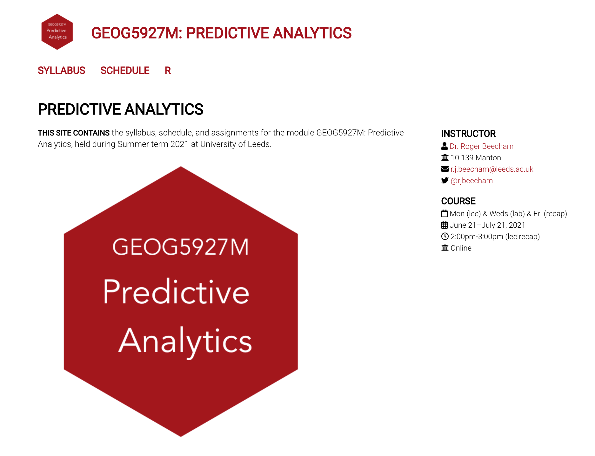
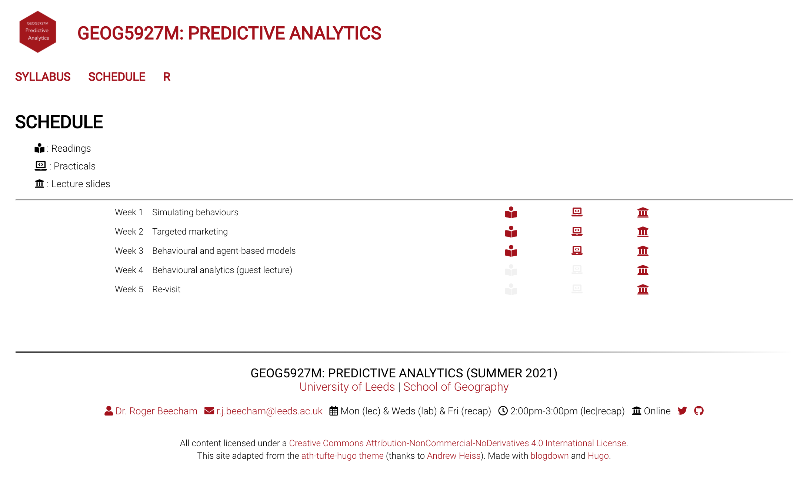
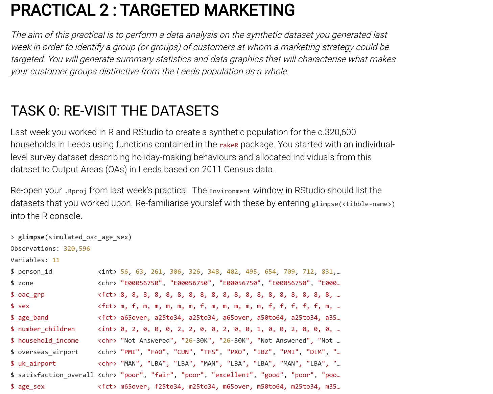
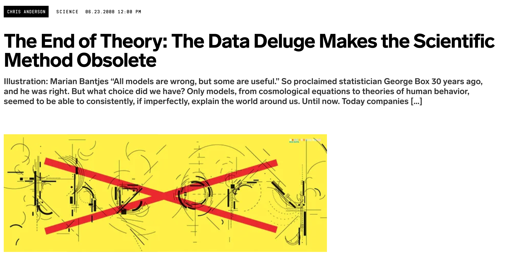
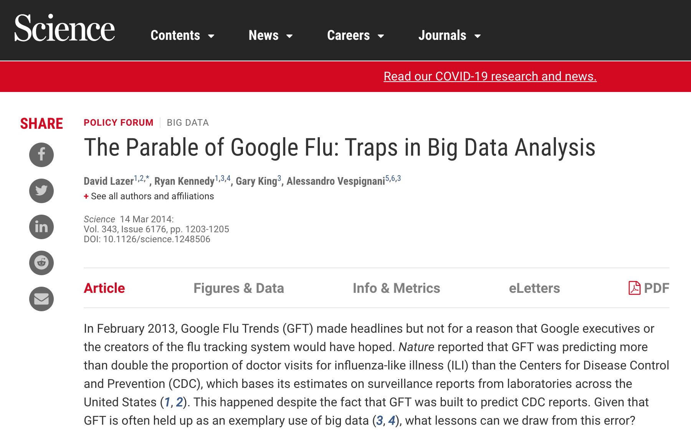
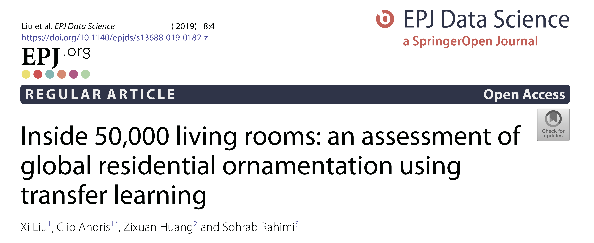
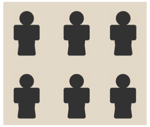
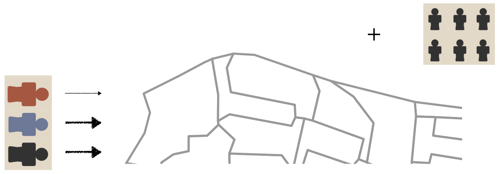

```{r setup, include=FALSE, echo=FALSE}
options(htmltools.dir.version = FALSE)
knitr::opts_chunk$set(comment = "")
library(tidyverse)
library(here)
library(knitr)
library(kableExtra)
```

class: center middle

.center[
</img>
]

???

Looked at module website
Also on Minerva
1. Introduce Module
2. Say how it will run
3. Say a bit on timings
4. Look at the first bit of subtantive work -- practical 1
---

## Module content and philosophy


* Spatial modelling to simulate and predict consumer behaviour
  + Exploratory analysis
  + Microsimulation
  + Agent-based modelling

<br>

* Research case studies to evaluate modelling techniques in practice
  + Practical sessions
  + Individual data science report
  + Group data science presentation

???
* Introduces some key theory and techniques in modern data analysis.
* Has both technical and applied aspects.
* Techniques in which Geog dept specialises
* Doing so with datasets and domains relevant to marketing science

---

## Outcomes

By the end of this module you should be able to:

1. **Explain** and **critically evaluate** the role of spatial analytics in simulating and predicting consumer behaviours

2. **Apply** geocomputational modelling and simulation techniques on real data sets

3. **Devise** and **employ** spatial modelling tools to address business problems, presenting and justifying recommendations in an appropriate context

---

???

1 : theory
2 : application
3 : both


---
## Module team


```{r team, echo=FALSE, out.width="100%"}
team <- tibble::tibble(
  img = "",
  name = c("Roger Beecham", "Jiaqi Ge", "Nik Malleson", "Rachel Oldroyd"),
  role = c("Convenor", "Lecturer", "Lecturer", "Lecturer"),
  sessions = c("1,2,4,5", "3,5", "3,5", "5"),
  assignments = c("1", "2", "NA", "NA")
)
kbl(team) %>%
  row_spec(0, background = "#ffffff", font_size = 18) %>%
  row_spec(1:4, background = "#ffffff", font_size = 20) %>%
  column_spec(1, image = spec_image(
    c("img/profile_roger.jpg", "img/profile_jg.jpg", "img/profile_nik.jpg", "img/profile_rachel.jpeg"), 250, 250))
```

---
## Scheduling


```{r schedule, echo=FALSE, out.width="100%"}
schedule <- tibble::tibble(
  session = c("1", "2", "3", "4", "5"),
  wc =c("21 Jun", "28 Jun", "5 Jul", "12 Jul", "19 Jul"),
  lecture = c("mon 1400-1500", "mon 1400-1500", "mon 1400-1500", "mon 1400-1500", "mon 1400-1500"),
  lab = c("wed 0900-1200", "wed 0900-1200", "wed 0900-1200", "wed 0900-1200", "NA - pres"),
  recap = c("fri 0900-1000", "fri 0900-1000", "fri 0900-1000", "fri 0900-1000", "NA")
)
kbl(schedule) %>%
  row_spec(0, background = "#ffffff", font_size = 18 ) %>%
  row_spec(1:5, background = "#ffffff", font_size = 20)
```

???

Breakdown of activity : short and fat

---

## Outline : Lectures


```{r outline-lectures, echo=FALSE, out.width="100%"}
outline <- tibble::tibble(
  session = c("1", "2", "3", "4", "5"),
  wc =c("21 Jun", "28 Jun", "5 Jul", "12 Jul", "19 Jul"),
  academic=c("RB","RB", "JG/NM", "RO/RB", "RB/JG/NM/RO"),
  lecture = c("Predictive analytics & microsimulation", "Response modelling and targeted marketing", "Behavioural and agent-based models",
  "Coursework surgery", "Guest lecture and wrap-up")
)
kbl(outline) %>%
  row_spec(0, background = "#ffffff", font_size = 18 ) %>%
  row_spec(1:5, background = "#ffffff", font_size=20)
```
<br>
.small-font[
RB: Roger Beecham, JG: Jiaqi Ge, NM: Nik Malleson, RO: Rachel Oldroyd
]
---

## Assessment


* Assignment 1: 75%
  + Individual data analysis based on labs 1 and 2
  + 2,000 words, 4 figures
  + Thu 15th Jul 2021 by 2pm

<br>


* Assignment 2: 25%
  + Group presentations based on practical 3
  + Presentations submitted Tue 20th Jul, timed Q&A session Wed 21st Jul 2021

---

## Assessment


```{r outline-lectures-ass, echo=FALSE, out.width="100%"}
outline <- tibble::tibble(
  session = c("1", "2", "3", "4", "5"),
  wc =c("21 Jun", "28 Jun", "5 Jul", "12 Jul", "19 Jul"),
  academic=c("RB","RB", "JG/NM", "RO/RB", "RB/JG/NM/RO"),
  lecture = c("Predictive analytics & microsimulation", "Response modelling and targeted marketing", "Behavioural and agent-based models",
  "Coursework surgery", "Guest lecture and wrap-up"),
  deadline=c("","","","Ass 1","Ass 2")
)
kbl(outline) %>%
  row_spec(0, background = "#ffffff", color="#616161", font_size = 18 ) %>%
  row_spec(1:5, background = "#ffffff", font_size=20) %>%
  column_spec(1:4, color="#616161")
```
<br>
.small-font[
RB: Roger Beecham, JG: Jiaqi Ge, NM: Nik Malleson, RO: Rachel Oldroyd
]

---

## Assessment


```{r outline-lectures-ass-prog, echo=FALSE, out.width="100%"}
outline <- tibble::tibble(
  session = c("1", "2", "3", "4", "5"),
  wc =c("21 Jun", "28 Jun", "5 Jul", "12 Jul", "19 Jul"),
  academic=c("RB","RB", "JG/NM", "RO/RB", "RB/JG/NM/RO"),
  lecture = c("Predictive analytics & microsimulation", "Response modelling and targeted marketing", "Behavioural and agent-based models",
  "Coursework surgery", "Guest lecture and wrap-up"),
  deadline=c("","","","Ass #1","Ass #2"),
  progress=c("#1 data","#1 analysis","#2 material","#1 surgery","#2 surgery")

)
kbl(outline) %>%
  row_spec(0, background = "#ffffff", color="#616161", font_size = 18 ) %>%
  row_spec(1:5, background = "#ffffff", font_size=20) %>%
  column_spec(1:4, color="#616161")
```
<br>
.small-font[
RB: Roger Beecham, JG: Jiaqi Ge, NM: Nik Malleson, RO: Rachel Oldroyd
]

---


## How

</img>


---

## R Resources

.small-font[
* H. Wickham and G. Grolemund, R for Data Science, O’Reilly Media, 2017.
  + *The primer for doing data analysis with R.*
  + [Free online](https://r4ds.had.co.nz).

* R. Lovelace et al., Geocomputation with R, CRC Press, 2019.
  + *Comprehensively introduces spatial data handling in R.*
  + [Free online](https://geocompr.robinlovelace.net).

* K. Healy, Data Visualization: A Practical Introduction, Princeton University Press, 2018.
  + *Integrates ggplot2 code with key Information Visualization theory and using real social science datasets.*
  + [Free online -- draft version](https://socviz.co).
]
---

## Module Resources

* [Module website](https://www.roger-beecham.com/predictive-analytics/)
<br><br>
* [Module handbook](https://minerva.leeds.ac.uk/webapps/blackboard/content/listContentEditable.jsp?content_id=_7983617_1&course_id=_521220_1&mode=reset)
<br><br>
* [Assignment briefs](https://minerva.leeds.ac.uk/webapps/blackboard/content/listContentEditable.jsp?content_id=_7983616_1&course_id=_521220_1&mode=reset)
<br><br>
* [Assignment submission page](https://minerva.leeds.ac.uk/webapps/blackboard/content/listContentEditable.jsp?content_id=_7983621_1&course_id=_521220_1&mode=reset)

???

If not already, spend time on Module Handbook.


---

## Module Website

--

</img>

--

</img>


--

</img>

---

## How to Learn
--

* *Come to "remote" lectures and labs* <br>
--

* *Engage: Try stuff out, ask questions* <br>
--

* *Contribute to the module [Slack](https://predictive-analytics.slack.com)* <br>
--

* *Coursework throughout: lectures and labs*

---

class: center middle

# Introduction to Predictive Analytics

???

* That's introduction to module...
* Push on with a bit of theory…
* Why Predictive Analytics

---


## Data-driven science

**"big data"** and **"data science"** on Google Trends, Oct 2019

</img>

???

Know already, but from 2010s -- big data is a big industry -- transforming the way businesses, societies run
Calling upon new ways of doing science

---

## Data-driven science

.small-font[
* 1000 years ago -- **experimental science**
	+ Description of natural phenomena

* 100s years ago -- **theoretical science**
	+ Newton’s laws, Maxwell’s Equations

* <50 years ago -- **computational science**
	+ Simulate complex phenomena

* Today -- **data-intensive science**
  + Generate knowledge through 	observation
]


</img>


???

Tony Hey :

* Experimental science :  all we could know about was what we observed directly
* Theory : abstracting above observations to generate fundamental laws about how things are
* Sumulation : Test theories by simulating real world
* Today : Back observation, but deriving new ways in new ways


---

## Data-driven science

.small-font[
> *The next generation of scientific discovery will be data-driven as previously unrecognised patterns are discovered by analysing massive and mixed datasets.*
>
> David Willets MP, 2013, Then Minister for Universities and Science
]
--

</img>


---

## Data-driven science : example

<div class="embed-responsive embed-responsive-16by9">
<iframe width="500" height="350" class="embed-responsive-item" src="https://www.youtube.com/embed/6111nS66Dpk" frameborder="0" allow="accelerometer; autoplay; encrypted-media; gyroscope; picture-in-picture" allowfullscreen></iframe>
</div>

???

Generate knowledge in new ways


* Real-time google searches tell us something about what is happening in the world.
* Association between how many people search for flu-related topics and how many people actually have flu symptoms.
* Can we use these to to estimate how much flu is circulating and predict outbreak?

---

## Data-driven science : example

</img>

[`Lazer et al. 2014`](https://science.sciencemag.org/content/343/6176/1203.full)

???

* Biases need to be more thoroughly thought through


---


## Data-driven science : example

</img>

</img>

???

* Generate new types of knowledge — newly opened up for analysis

*How* people choose to decorate their homes — is is culturally and geographically distinctive. Or in a globalised world does a typical home London decorate the same as a typical home in Tokyo?

Computer Vision  algorithms to automatically detect presence of certain ornaments and stylistic objects —see if there is spatial consistency in these…

---

## Data-driven science : example

.small-font[
[`fivethirtyeight.com/parole-assessment-simulator/`](https://projects.fivethirtyeight.com/parole-assessment-simulator/)
]

</img>


</img>

???

* Sentencing based typically on a criminal’s past crimes…
* But here on *likely* crimes that individuals might commit in the future.
* Based on statistical associations in past offender dataset
* Using statistical probabilities based on factors such as age, employment history and prior criminal record
* *Targeted* intervensions

---


## Data-driven science : this module

<br>
.pull-left[.small-font[
**Data mining and machine learning** — <br>
Detect hidden patterns in data


**Information Visualization** — <br>
Explore complex structure and patterns in data


**Predictive analytics** — <br>
Predict, under uncertainty, what will happen in future
]
]

</img>

---


## Data-driven science : assignments

<br>
.pull-left[.small-font[
.small-font[
**Assignment 1 -- ** <br> Generate a large synthetic dataset of customers <br>
and look for behavioural and demographic associations between individuals <br>
to better *target* marketing activity.

<br>

**Assignment 2 -- ** <br> Use data and heuristics to explore and predict <br>
how customers behave and respond to different store formats.
]]
]

</img>


---
class: center middle

# Session 1 : Simulating Behaviour

---


## Simulating behaviour practical


</img>

---

## Spatial microsimulation


.pull-left[.right[
`Survey data`
.small-font[
individual-level and rich in detail <br>
small sample and may be biased
]]
]

</img>


<br><br><br><br><br><br><br>

.pull-right[.left[
`Census data`
.small-font[
high-level and low in detail <br>
population-level and complete
]]
]

</img>


???

Many situations where interested in knowing population that lives in an area: interests, preferences, spending patterns

Are population-level datasets that exist.:

Census is amazing for counting people according to high-level characteristics...

But we only have a limited set of attribute information.

Lots missed off from it – commercial setting – interests and preferences.

Instead -- rely on comparatively small sample survey data for studying interests and preferences.

Spatial microsimulation allows us to match rich individual-level data to a population we know less about.


---

## Spatial microsimulation

<br><br><br>
.small-font[
> *The creation, analysis and modelling of individual-level data allocated to geographic zones.*
>
> Lovelace & Dumont 2016
]


---

## Spatial microsimulation

<br><br><br>
</img>

???

1. Start: survey of individuals and a geographic area. Each one of these spatial units is a small area of Leeds.
2. Allocate individuals from the survey to the small spatial units of Leeds. Lots of copies of individuals – such that they sum to the entire population in that area.


---


## Spatial microsimulation

<br><br><br>
</img>


???

Random allocation sounds not very sensible.

In microsim do so using some prior information on those spatial units – that you know about from a real dataset -- from the census in this case.

If Census says that 60% are orange, 30% black and 10% blue, copy individuals from the survey based data in those same proportions...

Notice arrows are varying in thickness to communicate this.

Census acts as constraints – give us a better approximation of the populations than just randomly allocating.


---

## Spatial microsimulation

<br><br><br><br><br><br>
</img>

---


## Spatial microsimulation

<br><br><br><br>
</img>

???

Blue: 40%
Black: 40%
Orange: 20%

---

## Spatial microsimulation

<br>
.pull-left[.right[
Microsimulation does not<br>
generate **new data** <br>
`-----`
]]

--

<br><br>
.pull-right[.left[
`-----` <br>
But **copies of existing data**
]]
---


## Spatial microsimulation: Examples

Health : Smoking <br>
  .small-font[[Tomintz et al. 2008](https://rgs-ibg.onlinelibrary.wiley.com/doi/abs/10.1111/j.1475-4762.2008.00837.x)]

--
.small-font[
 .pull-left[.right[
    **Why?** <br>
    Reported in individual surveys, but not population-level and not from place-to-place
    ]]]
--

  .small-font[.pull-right[.left[
    **Benefits** <br>
    Could be used to target/locate smoking support clinics
  ]]]
--
  .small-font[.pull-right[.left[
    **"Benefits"** <br>
    Could be used by a Tobacco company for targeting investment
  ]]
  ]

???

Estimate levels of smoking in a population.

---

## Spatial microsimulation: Examples

Economics : Policy Evaluation <br>
  .small-font[[De Agostini et al. 2016](https://www.econstor.eu/bitstream/10419/197592/1/868840475.pdf)]

--
.small-font[
 .pull-left[.right[
    **Why?** <br>
    Simulate / spread impacts inferred from individual-level data over an entire country
    ]]]

--
  .small-font[
  .pull-right[.left[
    **Benefits** <br>
    Quantify (under uncertainty) the impacts of a regressive welfare reform at the country-level

  ]]]

--
  .small-font[.pull-right[.left[
    **Benefits** <br>
    Evidence-based decision-making
  ]]]


---


## Spatial microsimulation: Examples

Transport : Simulating travel behaviour <br>
  .small-font[[Lovelace et al. 2014](https://www.sciencedirect.com/science/article/pii/S0966692313001361)]

--
.small-font[
 .pull-left[.right[
    **Why?** <br>
    When designing infrastructure, want to know about the distribution of individuals meeting a particular set of characteristics

    ]]]
--
.small-font[
  .pull-right[.left[
    **Benefits** <br>
    provide evidence around likely winners and losers of a new infrastructure investment

  ]]
  ]
---


## Spatial microsimulation: Assumptions

 .pull-left[
.small-font[
1. Individual-level microdata are representative of the study area <br>

2. Target variable is dependent on the constraint variables in a way that is relatively constant over space and time <br>

3. Input microdataset and constraints are sufficiently rich and detailed to reproduce the full diversity of individuals and areas in the study region
]]


???

Want to establish some link between the phenomena that you’re studying and the demographics that you’re using as constraints..

Points 2 and 3.

For example , you might be studying cycling propensity. There’s an association between cycling and social-demographics.

But is the relationship between socio-demographics and propensity to cycle is the same in London as it is in Newcastle – if we’re simulating from survey data over a country-level.

Final point: you want census constraints that discriminate people well.

---


## Simulating behaviour practical

 .pull-left[
 <br>
</img>
]

 .pull-right[
 <br>
 .small-font[
`individuals.csv : 15,189 records`
  <br>
  `-------` <br>
  spatial microsimulation <br>
  `-------` <br>
  `simulated_oac_age_sex.csv : 320,596 records`
]]
---


## Simulating behaviour practical: survey dataset

<br>

`individuals.csv`
  `15,189 records`

  ```{r survey-data, echo=FALSE, out.width="100%"}
  team <- tibble::tibble(
    var_name = c("age_band", "income_band", "oac_grp", "uk_airport", "overseas_airport", "satisfaction_overall"),
    var_values = c("a24under, ...", "11-15k, ...", "1,2,3,...", "MAN, DSA, ...","TFS, EFL, ...", "1_poor, ..."),
    var_type = c("demographic", "demographic", "geodemographic", "preference", "preference", "preference/attitude")
  )
  kbl(team) %>%
    row_spec(0, background = "#ffffff", font_size = 18) %>%
    row_spec(1:6, background = "#ffffff", font_size = 16)
  ```

???

People holidaying to destinations…


---


## Simulating behaviour practical : use case


</img>


???

There are different types of holiday destination.

---


## Simulating behaviour practical : use case


</img>

???

Different categories of people to different destinations

---
## Simulating behaviour practical : use case

.small-font[
`individuals.csv`
  `15,189 records`
  <br>
  `--------`
]
</img>

???

This is just a survey…
Imagine we’re a Leeds-based company…
Want to know how  whole of Leeds is likely to behave
Use microsimulation to get to this level
---

## Module Schedule

```{r schedule-again, echo=FALSE, out.width="100%"}
kbl(schedule) %>%
  row_spec(0, background = "#ffffff", font_size = 18 ) %>%
  row_spec(1:5, background = "#ffffff", font_size = 20) %>%
  row_spec(2:5, color="#616161")
```
