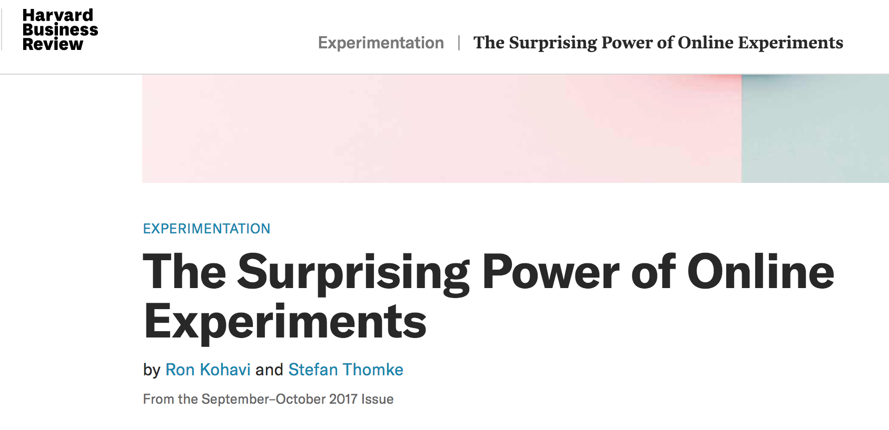
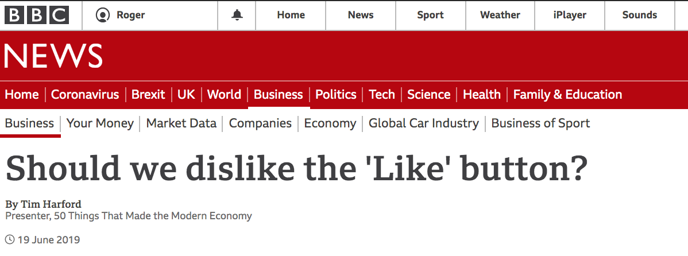
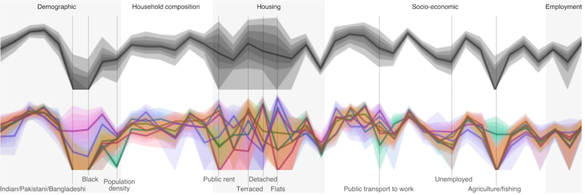
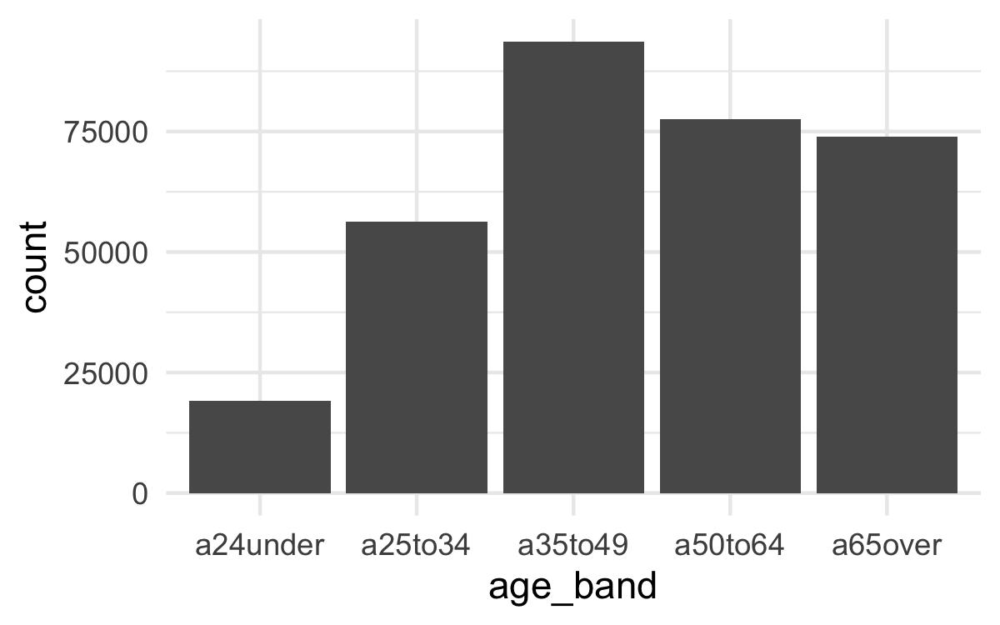
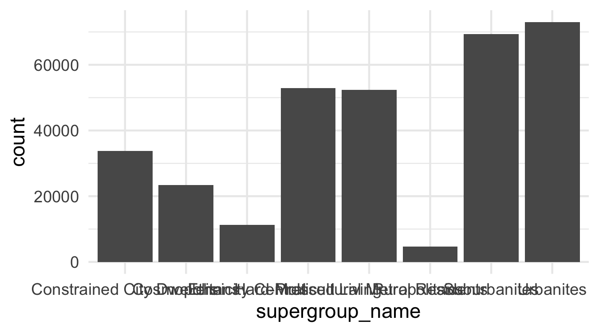
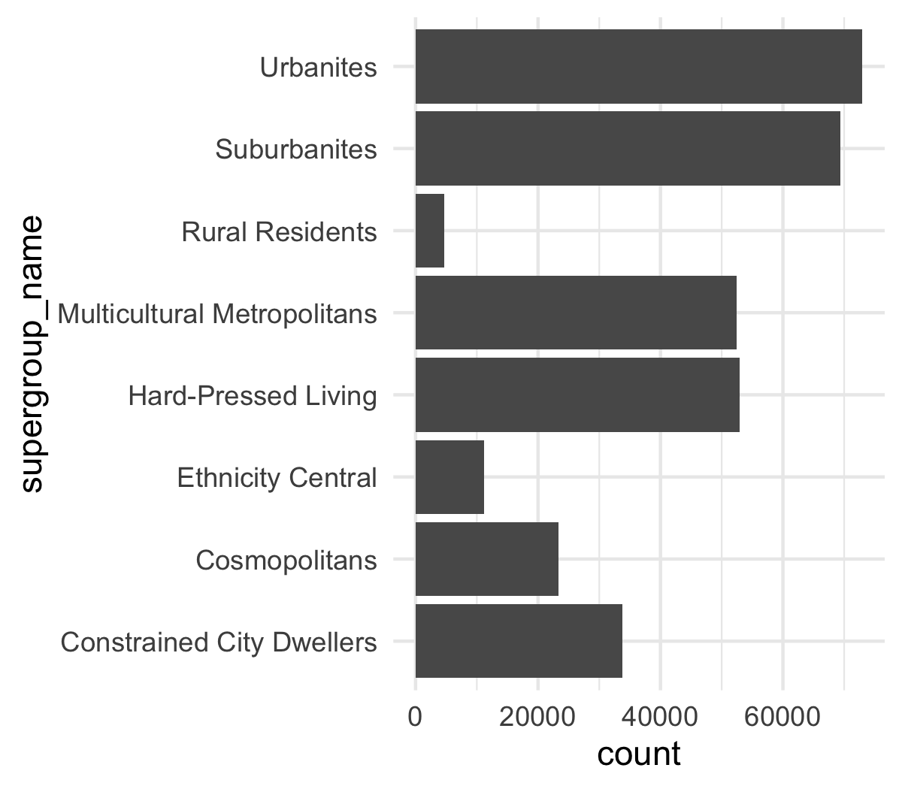
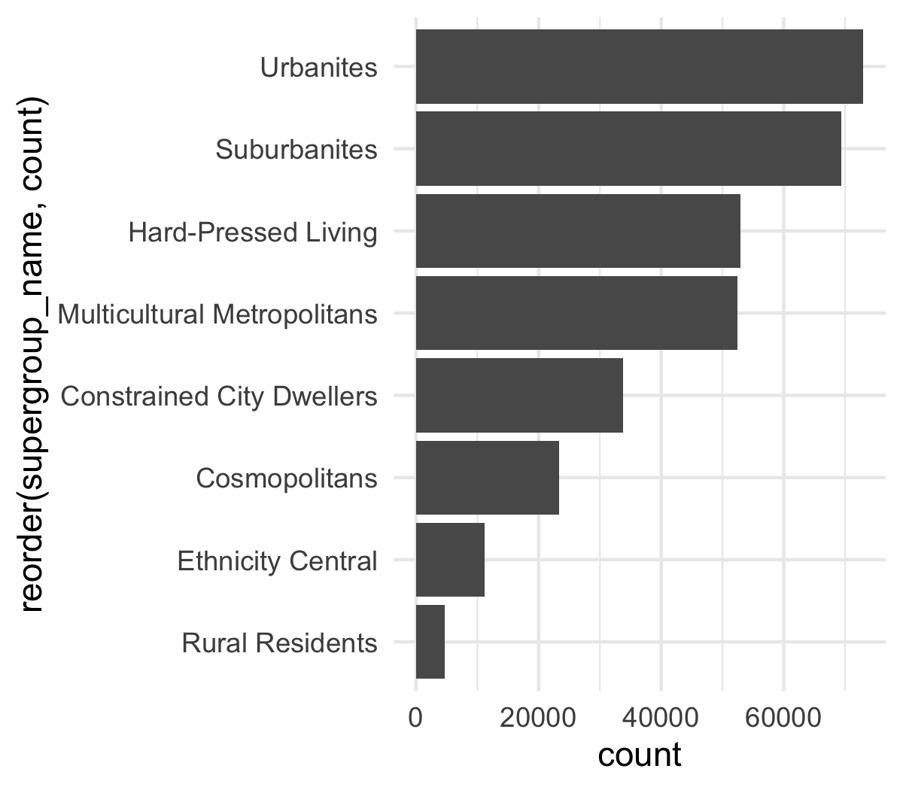
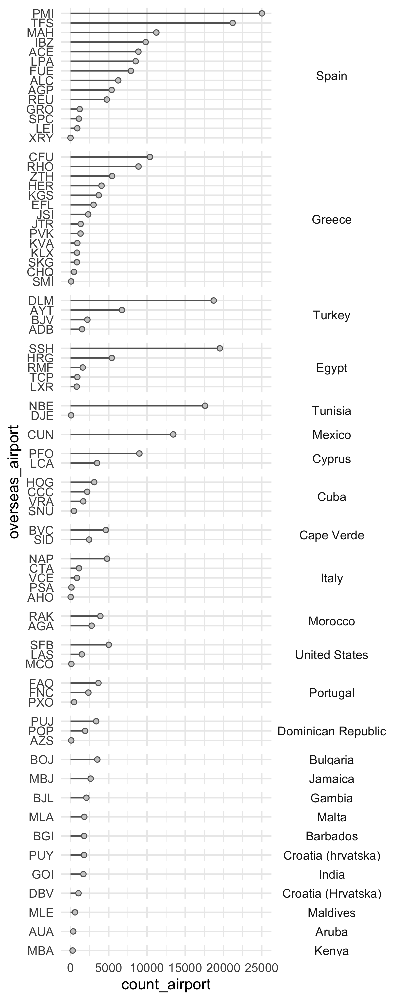
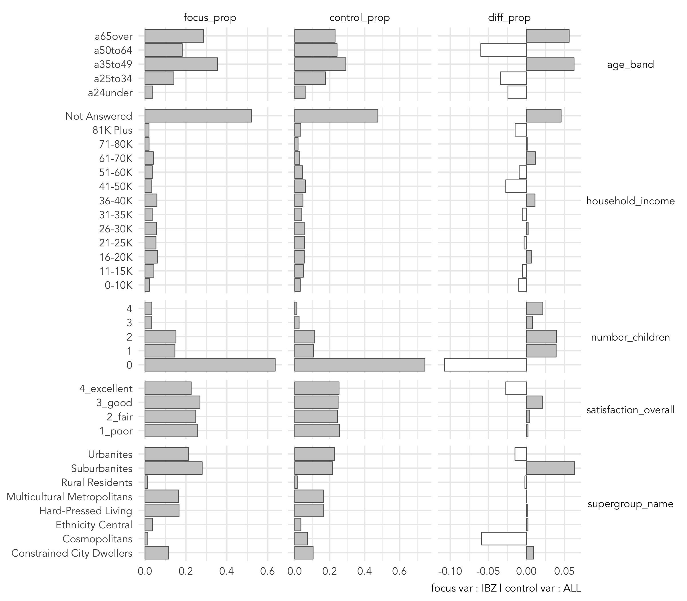

```{r setup, include=FALSE, echo=FALSE}
options(htmltools.dir.version = FALSE)
knitr::opts_chunk$set(comment = "")
library(tidyverse)
library(here)
library(knitr)
library(kableExtra)
```


## Module Schedule

```{r outline, echo=FALSE, out.width="100%"}
outline <- tibble::tibble(
  session = c("1", "2", "3", "4", "5"),
  wc =c("28 Feb", "7 Mar", "14 Mar", "21 Mar", "25 Apr"),
  academic=c("RB","RB", "RO", "JG/NM", "JG/NM"),
  lecture = c("Simulating behaviour", "Targeted marketing", "Machine learning",
  "Agent-based models", "Close"),
  deadline=c("","","","Ass 1","Ass 2")
)
kbl(outline) %>%
  row_spec(0, background = "#ffffff", color="#616161", font_size = 18 ) %>%
  row_spec(1:5, background = "#ffffff", font_size=20) %>%
  column_spec(1:4, color="#616161")
```

---


## Targeted Marketing

*df.*
> Use of data and analytics to **characterise** customer populations, such that groups of customers likely to **respond best** to a message can be targeted and marketing **messages** can be **personalised** according to customer group

---

## Targeted Marketing: Recommender systems

.tiny-font[
*df.*
> Use of data and analytics to **characterise** customer populations, such that groups of customers likely to **respond best** to a message can be targeted and marketing **messages** can be **personalised** according to customer group]

<br>

.tiny-font[
*e.g.*
]
.xtiny-font[
Linden, G., Smith, B. and York, J. (2003) Amazon.com Recommendations: Item-to-Item Collaborative Filtering, IEEE Internet Computing,   7(1): 76-80
]
</img>

???

Everywhere

* Items -- products, movies, events, articles – are recommended to users
* 35% of Amazon sales are from recommendations
* 2/3 of Netflix movies


---

## Targeted Marketing: Recommender systems


.xtiny-font[
Linden, G., Smith, B. and York, J. (2003) Amazon.com Recommendations: Item-to-Item Collaborative Filtering, IEEE Internet Computing,   7(1): 76-80
]
</img>

???

Two categories

--
.tiny-font[
* Content or behvaioural based recommender systems
  + generate probabilities that user will like a product based on past behaviour
  + e.g. Spotify recommending tracks]

???

Content assumes past behaviour predicts future behaviour

--
<br>
.tiny-font[
* Demographic based recommender systems
    + generate probabilities that user will like content based on the past behaviour of similar users
    + e.g. Facebook directing adds/features
]

???

Demographic assumes similar people have similar preferences/behaviours

More data available, the better these algorithms are at recommending.
That data are being collected continuously is really important…

This is targeted marketing as specific products are targeted as specific individuals


---

## Targeted Marketing: Political micro-targeting


???
This idea of personalised messaging has recently been exposed though political marketing…

--

.tiny-font[
*df.* targeted marketing
> Use of data and analytics to **characterise** customer populations, such that groups of customers likely to **respond best** to a message can be targeted and marketing **messages** can be **personalised** according to customer group]

<br>

--
.tiny-font[
*df.* micro-targeting
> A marketing strategy that capitalizes on the consumer’s demographic, psychographic, geographic, and behavioral data to predict his buying behavior, interests, opinions, and **influence** that behavior with the help of a hyper-targeted advertising strategy

>Pawha, 2018
]

<!-- <a href="https://hbr.org/2017/09/the-surprising-power-of-online-experiments">
</img>
   </a> -->


---

## Targeted Marketing: Political micro-targeting

.tiny-font[
*df.* micro-targeting
> A marketing strategy that capitalizes on the consumer’s demographic, psychographic, geographic, and behavioral data to predict his buying behavior, interests, opinions, and **influence** that behavior with the help of a hyper-targeted advertising strategy

>Pawha, 2018
]

--

</img>

</img>

???

* Aleksander Kogan made  personality-quiz app for Facebook.
* 270k installed app which allowed access to users *and* but their friends profiles.
* Stored data -- not deleted -- later provided to Cambridge Analytica  where made 30 million “psychographic” profiles of voters.
* Made and tested directly targeted ads for Leave, Ted Cruz and Trump

---

## Targeted Marketing: Political micro-targeting

.tiny-font[
*df.* micro-targeting
> A marketing strategy that capitalizes on the consumer’s demographic, psychographic, geographic, and behavioral data to predict his buying behavior, interests, opinions, and **influence** that behavior with the help of a hyper-targeted advertising strategy

>Pawha, 2018
]

<iframe width="400" height="500" frameborder="0" src="https://www.bbc.co.uk/news/av-embeds/48364817/vpid/p063yz0g"></iframe>

<a href="https://www.bbc.co.uk/news/business-48364817">
  </img>
</a>

---


## Targeted "Marketing": Criminal justice

.small-font[
[`fivethirtyeight.com/parole-assessment-simulator/`](https://projects.fivethirtyeight.com/parole-assessment-simulator/)
]

</img>


</img>


---


## Targeted Marketing: In the 1990s

.pull-left[
.small-font[
Analysis of c.12million transactions per week:

* Tailored campaigns/promotions targeted to certain groups
* Pricing strategies for target groups
* New products new ranges (e.g. Finest)
* Products bought by loyal customers prioritised
]]

.pull-right[
</img>
]

---

## Targeted Marketing: Segmentation


???

Talked a lot about examples : a key technique used through all of these is segmentation

---

## Targeted Marketing: Segmentation


.small-font[
*df.*
> Partition objects -- places, businesses, **customers** -- into groups according to shared characteristics]

--

.tiny-font[
* **indirect**: clearly defined, generally static
  + age
  + income
  + occupation
  + geographic location

* **direct**: defined analytically and can change
  + purchase behaviour
  + brand awareness
  + ad response]
---

## Targeted Marketing: Segmentation techniques

.tiny-font[
* **Recency-Frequency Monetary Value** (RFM)
 + quantile-based
 + 4 min read : `https://bit.ly/2KrVUia`


 * **Clustering**
  + k-means, density-based,  hierarchical
  + 11 min read : `https://bit.ly/355i01K`

* **Decision Trees**
  + chaid, cart, id3
  + 17 min read : `https://bit.ly/35aCXbG`
  + visual introduction : `https://bit.ly/3dZJyNn`
]

???

Three categories for consumer analytics
No time for all of these -- blog posts that give really nice high-level summaries.

RFM and Clustering : unsupervised grouping.

Decision Trees : supervised learning -- clear output variable is labelled to to guide grouping process.

---

## Targeted Marketing: Geodemographics

.tiny-font[
*Clustering df.*
> Partition objects -- places, businesses, people -- into groups according to shared characteristics such that
objects within groups are similar and objects between groups are different]

--

.tiny-font[
*Geodemographic clustering df.*
> Partition neighbourhoods, small areas, into groups according to their demographic characteristics such that
neighbourhoods within groups are demographically similar and neighbourhoods between groups are demographically different]

--
.tiny-font[
Why geographic clustering?
1. People who live in the same neighbourhood are likely to share similar purchase behaviours and preferences habits
2. Neighbourhoods can be *categorised* and *related* by their populations: two or more neighbourhoods with similar populations can be placed in the same category.
]

---

## Targeted Marketing: Geodemographics

.tiny-font[
*Geodemographic clustering df.*
> Partition neighbourhoods, small areas, into groups according to their demographic characteristics such that
neighbourhoods within groups are demographically similar and neighbourhoods between groups are demographically different]

<a href="https://oac.datashine.org.uk/#datalayer=oac11_s&layers=BTTT&zoom=12&lon=-0.1500&lat=51.5200">
  </img>
</a>

<br><br><br><br><br><br><br><br><br>
.xtiny-font[
Leventhal, B. 2016. Geodemographics for Marketers: Using location
analysis for research and marketing. [Available online](https://leeds.primo.exlibrisgroup.com/discovery/fulldisplay?docid=alma991013055919705181&context=L&vid=44LEE_INST:VU1&lang=en&search_scope=My_Inst_CI_not_ebsco&adaptor=Local%20Search%20Engine&tab=AlmostEverything&query=any,contains,991013055919705181&sortby=date_d&facet=frbrgroupid,include,9031409011017862701&offset=0)
]
---

## Targeted Marketing: Geodemographics

.tiny-font[
*Geodemographic clustering df.*
> Partition neighbourhoods, small areas, into groups according to their demographic characteristics such that
neighbourhoods within groups are demographically similar and neighbourhoods between groups are demographically different]

<a href="https://www.gicentre.net/slingsbyexploring2011">
  </img>
</a>

<br><br><br><br><br><br><br>
.xtiny-font[
Slingsby, A., Dykes, J. & Wood, J. (2011). Exploring uncertainty in geodemographics with interactive graphics. IEEE Transactions on Visualization and Computer Graphics, 17(12), pp. 2545-2554. [Open Access](https://openaccess.city.ac.uk/id/eprint/437/)
]
---

## Targeted Marketing: Practical


</img>


---

## Targeted Marketing: Practical


</img>
.tiny-font[
[`Assignment #1 url`](https://minerva.leeds.ac.uk/webapps/blackboard/content/listContentEditable.jsp?content_id=_7983616_1&course_id=_521220_1&mode=reset)]

---

## Targeted Marketing: Practical


</img>
.tiny-font[
[`Assignment #1 url`](https://minerva.leeds.ac.uk/webapps/blackboard/content/listContentEditable.jsp?content_id=_7983616_1&course_id=_521220_1&mode=reset)]

---


## Targeted Marketing: Practical


</img>

???
There are different types of holiday destination.

---


## Targeted Marketing: Practical


</img>

???
Different categories of people to different destinations

City breaks versus Beach holidays


---
## Targeted Marketing: Practical

.small-font[
`individuals.csv`
  `15,189 records`
  <br>
  `--------`
]
</img>


???

* Just a survey…
* Imagine we’re a Leeds-based that wants to know how the whole of Leeds is likely to behave
* microsimulation to get to this level

---

## Targeted Marketing: Practical

.small-font[Identify and profile a target market using:]

 .tiny-font[
* **Demographics**
   + income, age, household structure

* **Geography**
   + where and what types of areas they tend to live in

* **Psychographics**
    +  their motivations and preferences
]

???

1. Define group of interest -- destination type / customer type
2. Identify what makes those holidaying there distinctive
3. So that can target in particular ways

Of interest:

* demographics : what types of people in terms of income, age profile?
* geography : where those individuals live (heavily related to demogs)?
* psychographics : their preferences, motivations and more subjective tastes

---

## Targeted Marketing: Practical

`simulated_oac_age_sex.csv`
  `320,596 records`

  ```{r survey-data, echo=FALSE, out.width="100%"}
  team <- tibble::tibble(
    var_name = c("age_band", "income_band", "oac_grp", "uk_airport", "overseas_airport", "satisfaction_overall"),
    var_values = c("a24under, ...", "11-15k, ...", "1,2,3,...", "MAN, DSA, ...","TFS, EFL, ...", "1_poor, ..."),
    var_type = c("demographic", "demographic", "geodemographic", "preference", "preference", "preference/attitude")
  )
  kbl(team) %>%
    row_spec(0, background = "#ffffff", font_size = 18) %>%
    row_spec(1:6, background = "#ffffff", font_size = 16)
  ```

---

## Targeted Marketing: Practical


</img>

</img>

???

In the guided data analysis in the practical, you’re asked to profile those holidaying to IBIZA.

* This population has two age peaks
* Comparatively few higher incomes
* Mix of more affluent and deprived neighbourhood types

But is this particularly distinctive? How does this relate to all of Leeds (all households in our simulated dataset)?

---

## Targeted Marketing: Practical


</img>
</img>
</img>

---

## Targeted Marketing: Practical


</img>
</img>
</img>
</img>

---


## Targeted Marketing: Practical

<br>
.small-font[**Deviation** from **Expectation**]

</img>

<br><br><br><br><br><br><br>
.xtiny-font[Correll & Heer (2017) Surprise! Bayesian Weighting for De-Biasing Thematic Maps, IEEE TVCG]

---


## Setup

#### Task 1.1 Attach OAC and Airport names

.tiny-font[`simulated_oac_age_sex`]

.xtiny-font[
```{r sim-dataset, eval=FALSE, echo=TRUE, out.width="100%"}
> glimpse(simulated_oac_age_sex)
Rows: 320,596
Columns: 11
$ person_id            <dbl> 56, 63, 261, 306, 326, 348, 402, 495, 654, 709, 712, 831, 1000, 1030, 1250, 1447, 1532,…
$ zone                 <chr> "E00056750", "E00056750", "E00056750", "E00056750", "E00056750", "E00056750", "E0005675…
$ oac_grp              <fct> 8, 8, 8, 8, 8, 8, 8, 8, 8, 8, 8, 8, 8, 8, 8, 8, 8, 8, 8, 8, 8, 8, 8, 8, 8, 8, 8, 8, 8, …
$ sex                  <fct> m, f, m, m, m, m, m, f, m, m, m, m, m, f, f, f, f, f, m, f, m, m, f, f, f, f, m, f, m, …
$ age_band             <fct> a65over, a25to34, a25to34, a65over, a50to64, a25to34, a35to49, a65over, a50to64, a35to4…
$ number_children      <dbl> 0, 2, 0, 0, 0, 2, 2, 0, 0, 2, 0, 0, 1, 0, 0, 2, 0, 0, 0, 0, 0, 1, 0, 0, 0, 0, 1, 1, 0, …
$ household_income     <chr> "Not Answered", "26-30K", "26-30K", "Not Answered", "Not Answered", "Not Answered", "61…
$ overseas_airport     <chr> "PMI", "FAO", "CUN", "TFS", "PXO", "IBZ", "PMI", "DLM", "CFU", "GRO", "ZTH", "AGA", "BJ…
$ uk_airport           <chr> "MAN", "LBA", "LBA", "MAN", "LBA", "LBA", "MAN", "LBA", "LBA", "MAN", "MAN", "MAN", "LB…
$ satisfaction_overall <chr> "1_poor", "2_fair", "1_poor", "4_excellent", "3_good", "1_poor", "1_poor", "4_excellent…
$ age_sex              <fct> m65over, f25to34, m25to34, m65over, m50to64, m25to34, m35to49, f65over, m50to64, m35to4…
```
]

.tiny-font[Join on `oac_lookup`, `airport_lookup`]

.xtiny-font[
```{r sim-dataset-joined, eval=FALSE, echo=TRUE, out.width="100%"}
> glimpse(simulated_oac_age_sex)
Rows: 320,596
Columns: 18
$ person_id            <dbl> 56, 63, 261, 306, 326, 348, 402, 495, 654, 709, 712, 831, 1000, 1030, 1250, 1447, 1532,…
$ zone                 <chr> "E00056750", "E00056750", "E00056750", "E00056750", "E00056750", "E00056750", "E0005675…
$ oac_grp              <chr> "8", "8", "8", "8", "8", "8", "8", "8", "8", "8", "8", "8", "8", "8", "8", "8", "8", "8…
$ sex                  <fct> m, f, m, m, m, m, m, f, m, m, m, m, m, f, f, f, f, f, m, f, m, m, f, f, f, f, m, f, m, …
$ age_band             <fct> a65over, a25to34, a25to34, a65over, a50to64, a25to34, a35to49, a65over, a50to64, a35to4…
$ number_children      <dbl> 0, 2, 0, 0, 0, 2, 2, 0, 0, 2, 0, 0, 1, 0, 0, 2, 0, 0, 0, 0, 0, 1, 0, 0, 0, 0, 1, 1, 0, …
$ household_income     <chr> "Not Answered", "26-30K", "26-30K", "Not Answered", "Not Answered", "Not Answered", "61…
$ overseas_airport     <chr> "PMI", "FAO", "CUN", "TFS", "PXO", "IBZ", "PMI", "DLM", "CFU", "GRO", "ZTH", "AGA", "BJ…
$ uk_airport           <chr> "MAN", "LBA", "LBA", "MAN", "LBA", "LBA", "MAN", "LBA", "LBA", "MAN", "MAN", "MAN", "LB…
$ satisfaction_overall <chr> "1_poor", "2_fair", "1_poor", "4_excellent", "3_good", "1_poor", "1_poor", "4_excellent…
$ age_sex              <fct> m65over, f25to34, m25to34, m65over, m50to64, m25to34, m35to49, f65over, m50to64, m35to4…
$ supergroup_name      <chr> "Hard-Pressed Living", "Hard-Pressed Living", "Hard-Pressed Living", "Hard-Pressed Livi…
$ dest_airport_name    <chr> "Palma Mallorca", "Faro", "Cancun", "Sur Reina Sofia", "Porto Santo", "Ibiza", "Palma M…
$ dest_airport_city    <chr> "Palma Mallorca", "Faro", "Cancun", "Tenerife", "Porto Santo", "Ibiza", "Palma Mallorca…
$ dest_airport_country <chr> "Spain", "Portugal", "Mexico", "Spain", "Portugal", "Spain", "Spain", "Turkey", "Greece…
$ orig_airport_name    <chr> "Manchester", "Leeds/Bradford", "Leeds/Bradford", "Manchester", "Leeds/Bradford", "Leed…
$ orig_airport_city    <chr> "Manchester", "Leeds", "Leeds", "Manchester", "Leeds", "Leeds", "Manchester", "Leeds", …
$ orig_airport_country <chr> "United Kingdom", "United Kingdom", "United Kingdom", "United Kingdom", "United Kingdom…
```
]


---

## Explore

#### Task 1.2: Generate frequency plots

.tiny-font[
```{r plot-bar, eval=FALSE, echo=TRUE, out.width="100%"}
ggplot(
  data=simulated_oac_age_sex,
  mapping=aes(x=age_band)
  )+
  geom_bar()
```
]


.pull-left[
</img>
]
.pull-right[.tiny-font[
`ggplot2` form:
1. Identify *dataset*: `data=` | `<data> %>%`
2. Specify *mapping*: `aes(x=..., y=..., fill=...)`
3. Select *geometry* (or marks) layer: `geom_*`
]]

---

## Explore

#### Task 1.2: Generate frequency plots

.tiny-font[
```{r plot-bar-oac, eval=FALSE, echo=TRUE, out.width="100%"}
ggplot(
  data=simulated_oac_age_sex,
  mapping=aes(x=supergroup_name)
  )+
  geom_bar()
```
]

</img>


---


## Explore

#### Task 1.2: Generate frequency plots

.tiny-font[
```{r plot-bar-oac-flip, eval=FALSE, echo=TRUE, out.width="100%"}
ggplot(
  data=simulated_oac_age_sex,
  mapping=aes(x=supergroup_name)
  )+
  geom_bar()+
  coord_flip()
```
]

</img>


---

## Explore

#### Task 1.2: Generate frequency plots

.tiny-font[
```{r plot-bar-oac-flip-order, eval=FALSE, echo=TRUE, out.width="100%"}
simulated_oac_age_sex %>%
  group_by(supergroup_name) %>%
  summarise(count=n()) %>%
  ggplot(
    aes(x=reorder(supergroup_name, count), y=count)
    )+
  geom_bar(stat="identity")+
  coord_flip()
```
]

</img>


---

## Explore

#### Task 1.3: Generate frequency plots on variables with many categories

.pull-left[
.tiny-font[`order_country` -- staged data for charting:]
.xtiny-font[
```{r order-country, eval=FALSE, echo=TRUE, out.width="100%"}
# Generate tibble of countries ordered by frequency (for ordered factors).
order_country <- simulated_oac_age_sex %>%
  group_by(dest_airport_country) %>%
  summarise(count=n()) %>%
  arrange(-count)

> order_country
# A tibble: 25 x 2
   dest_airport_country  count
   <chr>                 <int>
 1 Spain                112128
 2 Greece                43543
 3 Turkey                29149
 4 Egypt                 28220
 5 Tunisia               17672
 6 Mexico                13438
 7 Cyprus                12488
 8 Cuba                   7394
 9 Cape Verde             7040
10 Italy                  6880
# … with 15 more rows
```
]]

.pull-right[.tiny-font[
Use in data pipe to Cleveland dotplot:]
.xtiny-font[
```{r order-country-effect, eval=FALSE, echo=TRUE, out.width="100%"}
simulated_oac_age_sex %>%
  # Order dest countries, casting as a factor
  # and ordering levels on frequency.
  mutate(
    dest_airport_country=
    factor(
      dest_airport_country,
      levels=order_country$dest_airport_country
      )
    )
```
]]
---

## Explore

#### Task 1.3: Generate frequency plots on variables with many categories

.pull-left[
.tiny-font[Cleveland data prep:]
.xtiny-font[
```{r cleveland-prep, eval=FALSE, echo=TRUE, out.width="100%"}
simulated_oac_age_sex %>%
  # Order dest countries, cast as a factor
  # and order on freq.
  mutate(
    dest_airport_country=
      factor(
        dest_airport_country,
        levels=order_country$dest_airport_country)
        ) %>%
  # Calculate num holidays to each dest airport.
  group_by(overseas_airport) %>%
    summarise(
      count_airport=n(),
      dest_airport_country=first(dest_airport_country)
      ) %>%
  # Order by these frequencies.
  arrange(count_airport) %>%
  # Cast as factor and order levels.
  mutate(
    overseas_airport=
      factor(
        overseas_airport,levels=.$overseas_airport)
        )
```
]
]

.pull-right[</img>
]
---
## Explore

#### Task 1.3: Generate frequency plots on variables with many categories

.pull-left[
.tiny-font[Cleveland plot spec:]
.xtiny-font[
```{r cleveland-plot, eval=FALSE, echo=TRUE, out.width="100%"}
# List airports vertically and frequencies horizontally.
  ggplot(
    aes(x=count_airport,y=overseas_airport)
    )+
    geom_segment(
      aes(
        x=0, y=overseas_airport, xend=count_airport,
        yend=overseas_airport
        ),
        colour="#636363"
      )+
    geom_point(
      colour="#636363", fill="#cccccc", shape=21
      )+
    # Facet the plot on country to display
    # group freq by destination country.
    facet_grid(
      dest_airport_country~.,
      scales="free_y",
      space="free_y"
      )

```
]
]

.pull-right[</img>]

---


## Explore research questions

#### Task 2.1: Calculate totals and proportions

.xtiny-font[
```{r calc-prop, eval=FALSE, echo=TRUE, out.width="100%"}
simulated_oac_age_sex %>%
  # Dummy variable identifying destination to be profiled: PMI.
  mutate(
    # Edit the if_else() to switch focus.
    dest_focus=if_else(overseas_airport=="PMI",1,0),
    total_focus=sum(dest_focus)
  ) %>%
  # Calculate proportions for each OAC group.
  group_by(supergroup_name) %>%
  summarise(
    oac_grp_focus=sum(dest_focus)/first(total_focus),
    oac_grp_control=n()/nrow(.),
    diff_focus_control=oac_grp_focus-oac_grp_control
  )


# A tibble: 8 x 4
  supergroup_name             oac_grp_focus oac_grp_control diff_focus_control
  <chr>                               <dbl>           <dbl>              <dbl>
1 Constrained City Dwellers          0.157           0.105            0.0513
2 Cosmopolitans                      0.0344          0.0729          -0.0385
3 Ethnicity Central                  0.0127          0.0350          -0.0223
4 Hard-Pressed Living                0.201           0.165            0.0355
5 Multicultural Metropolitans        0.140           0.163           -0.0233
6 Rural Residents                    0.0114          0.0144          -0.00304
7 Suburbanites                       0.216           0.216           -0.000310
8 Urbanites                          0.228           0.228            0.000638
```
]

---

## Explore research questions

#### Task 2.1: Calculate totals and proportions

.xtiny-font[
```{r calc-prop-cfu, eval=FALSE, echo=TRUE, out.width="100%"}
simulated_oac_age_sex %>%
  # Dummy variable identifying destination to be profiled: PMI.
  mutate(
    # Edit the if_else() to switch focus.
    dest_focus=if_else(overseas_airport=="CFU",1,0),
    total_focus=sum(dest_focus)
  ) %>%
  # Calculate proportions for each OAC group.
  group_by(supergroup_name) %>%
  summarise(
    oac_grp_focus=sum(dest_focus)/first(total_focus),
    oac_grp_control=n()/nrow(.),
    diff_focus_control=oac_grp_focus-oac_grp_control
  )


# A tibble: 8 x 4
  supergroup_name             oac_grp_focus oac_grp_control diff_focus_control
  <chr>                               <dbl>           <dbl>              <dbl>
1 Constrained City Dwellers         0.0708           0.105           -0.0344
2 Cosmopolitans                     0.112            0.0729           0.0394
3 Ethnicity Central                 0.00424          0.0350          -0.0308
4 Hard-Pressed Living               0.177            0.165            0.0119
5 Multicultural Metropolitans       0.129            0.163           -0.0340
6 Rural Residents                   0.0162           0.0144           0.00177
7 Suburbanites                      0.216            0.216           -0.000291
8 Urbanites                         0.274            0.228            0.0462

```
]

---


## Explore research questions

#### Task 2.1: Calculate totals and proportions

.xtiny-font[
```{r calc-prop-grp, eval=FALSE, echo=TRUE, out.width="100%"}
# Create a vector of destination names.
focus <- c("PMI","CFU","DLM")

simulated_oac_age_sex %>%
  # Dummy variable identifying destination(s) to be profiled.
  mutate(
    # Edit the if_else() to switch focus.
    dest_focus=if_else(overseas_airport %in% focus,1,0),
    total_focus=sum(dest_focus)
  ) %>%
  ...
  ...
  ...
  ...


# A tibble: 8 x 4
  supergroup_name             oac_grp_focus oac_grp_control diff_focus_control
  <chr>                               <dbl>           <dbl>              <dbl>
1 Constrained City Dwellers          0.128           0.105             0.0232
2 Cosmopolitans                      0.0682          0.0729           -0.00463
3 Ethnicity Central                  0.0286          0.0350           -0.00642
4 Hard-Pressed Living                0.184           0.165             0.0189
5 Multicultural Metropolitans        0.152           0.163            -0.0114
6 Rural Residents                    0.0113          0.0144           -0.00310
7 Suburbanites                       0.199           0.216            -0.0177
8 Urbanites                          0.229           0.228             0.00119

```
]

---


## Explore research questions

#### Task 2.1: Calculate totals and proportions

.pull-left[
.tiny-font[
Automate by creating a `function()`:
]
.xtiny-font[
```{r calc-prop-fun, eval=FALSE, echo=TRUE, out.width="100%"}
#' Calculate proportions for a focus and control variable,
#' with user-defined grouping.
#' @param data A df with focus and control variables
#' (focus_var, control_var).
#' @param group_var A string describing the grouping
#' variable passed as a symbol.
#' @return A df of focus and control proportions, with diff
#' values.

calculate_props <-
  function(data, group_var) {
  data %>%
    group_by(!!group_var) %>%
    summarise(
      focus_prop=sum(focus_var)/first(focus_total),
      control_prop=sum(control_var)/first(control_total),
      diff_prop=first(focus_prop)-first(control_prop),
      variable_type=rlang::as_string(group_var)
    ) %>%
    ungroup() %>%
    mutate(variable_name=!!group_var) %>%
    select(-!!group_var)
}
```
]]

.pull-right[
.tiny-font[Use function:]
.xtiny-font[
```{r generate-plot-proportions, eval=FALSE, echo=TRUE}
# Define grouping variable
group <- "supergroup_name"

# Identify the destination in focus.
focus <- "PMI"
control <- "ALL"

# calculate_props() requires control and focus variables,
# not yet contained in simulated dataset.
# Create a new dataset with these added.
temp_simulated_data <- simulated_oac_age_sex %>%
  mutate(
    focus_var=if_else(overseas_airport %in% focus,1,0),
    control_var=1,
    focus_total=sum(focus_var),
    control_total=sum(control_var),
    number_children=as.character(number_children)
 )


calculate_props(temp_simulated_data, rlang::sym(group))
```
]
]

---


## Explore research questions

#### Task 2.1: Calculate totals and proportions

.pull-left[
.tiny-font[
Automate by creating a `function()`:
]
.xtiny-font[
```{r calc-prop-fun-2, eval=FALSE, echo=TRUE, out.width="100%"}
#' Calculate proportions for a focus and control variable,
#' with user-defined grouping.
#' @param data A df with focus and control variables
#' (focus_var, control_var).
#' @param group_var A string describing the grouping
#' variable passed as a symbol.
#' @return A df of focus and control proportions, with diff
#' values.

calculate_props <-
  function(data, group_var) {
  data %>%
    group_by(!!group_var) %>%
    summarise(
      focus_prop=sum(focus_var)/first(focus_total),
      control_prop=sum(control_var)/first(control_total),
      diff_prop=first(focus_prop)-first(control_prop),
      variable_type=rlang::as_string(group_var)
    ) %>%
    ungroup() %>%
    mutate(variable_name=!!group_var) %>%
    select(-!!group_var)
}
```
]]

.pull-right[
.tiny-font[Use function:]
.xtiny-font[
```{r generate-plot-proportions-2, eval=FALSE, echo=TRUE}

calculate_props(temp_simulated_data, rlang::sym(group))

# A tibble: 8 x 5
  focus_prop control_prop diff_prop variable_type   variable_name
       <dbl>        <dbl>     <dbl> <chr>           <chr>
1     0.157        0.105   0.0513   supergroup_name Constrained City Dwellers
2     0.0344       0.0729 -0.0385   supergroup_name Cosmopolitans
3     0.0127       0.0350 -0.0223   supergroup_name Ethnicity Central
4     0.201        0.165   0.0355   supergroup_name Hard-Pressed Living
5     0.140        0.163  -0.0233   supergroup_name Multicultural Metropolitans
6     0.0114       0.0144 -0.00304  supergroup_name Rural Residents
7     0.216        0.216  -0.000310 supergroup_name Suburbanites
8     0.228        0.228   0.000638 supergroup_name Urbanites
```
]
]

---

## Explore research questions

#### Task 2.1: Calculate totals and proportions

.pull-left[
.tiny-font[
Automate by creating a `function()`:
]
.xtiny-font[
```{r calc-prop-fun-3, eval=FALSE, echo=TRUE, out.width="100%"}
#' Calculate proportions for a focus and control variable,
#' with user-defined grouping.
#' @param data A df with focus and control variables
#' (focus_var, control_var).
#' @param group_var A string describing the grouping
#' variable passed as a symbol.
#' @return A df of focus and control proportions, with diff
#' values.

calculate_props <-
  function(data, group_var) {
  data %>%
    group_by(!!group_var) %>%
    summarise(
      focus_prop=sum(focus_var)/first(focus_total),
      control_prop=sum(control_var)/first(control_total),
      diff_prop=first(focus_prop)-first(control_prop),
      variable_type=rlang::as_string(group_var)
    ) %>%
    ungroup() %>%
    mutate(variable_name=!!group_var) %>%
    select(-!!group_var)
}
```
]]

.pull-right[
.tiny-font[Use function in a [functional programming](https://purrr.tidyverse.org/) way:]
.xtiny-font[
```{r generate-plot-proportions-3, eval=FALSE, echo=TRUE}
purrr::map_df(
  groups,
  ~calculate_props(temp_simulated_data, rlang::sym(.x))
  )

# A tibble: 36 x 5
   focus_prop control_prop diff_prop variable_type   variable_name
        <dbl>        <dbl>     <dbl> <chr>           <chr>
 1     0.115        0.105   0.00930  supergroup_name Constrained City Dwellers
 2     0.0138       0.0729 -0.0590   supergroup_name Cosmopolitans
 3     0.0369       0.0350  0.00195  supergroup_name Ethnicity Central
 4     0.166        0.165   0.00118  supergroup_name Hard-Pressed Living
 5     0.164        0.163   0.000466 supergroup_name Multicultural Metropolitans
 6     0.0124       0.0144 -0.00201  supergroup_name Rural Residents
 7     0.279        0.216   0.0632   supergroup_name Suburbanites
 8     0.213        0.228  -0.0151   supergroup_name Urbanites
 9     0.0356       0.0598 -0.0242   age_band        a24under
10     0.141        0.176  -0.0343   age_band        a25to34
# … with 26 more rows
```
]
]

---

## Explore research questions

#### Task 2.2: Plot totals and proportions

.pull-left[
.xtiny-font[
```{r plot-props-code, eval=FALSE, echo=TRUE, out.width="100%"}
# Define two colours used to colour pos and neg bars differently
fill_colours <- c("#ffffff", "#cccccc")
temp_plot_data %>%
  gather(
    key=stat_type,
    value=stat_value,
    -c(variable_type, variable_name)
    ) %>%
  mutate(
    stat_type=factor(
      stat_type,
      levels=c("focus_prop","control_prop","diff_prop")
      ),
    stat_sign=stat_value>0
  ) %>%
  filter(!is.na(variable_name)) %>%
  ggplot(aes(x=variable_name, y=stat_value))+
  # stat_sign is a boolean identifying whether
  # stat_value is pos or neg.
  geom_col(aes(fill=stat_sign), colour="#636363", size=0.3)+
  scale_fill_manual(values=fill_colours, guide=FALSE)+
  facet_grid(
    variable_type~stat_type,
    scales="free", space="free_y"
    )+
  labs(caption=paste0("focus var : ",focus," | control var : ",control))+
  coord_flip()+
  theme(axis.title=element_blank()
```
]]

.pull-right[
</img>
]
