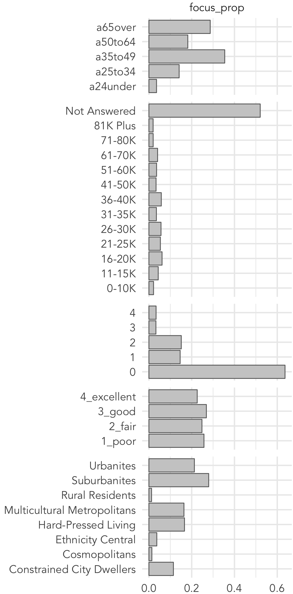
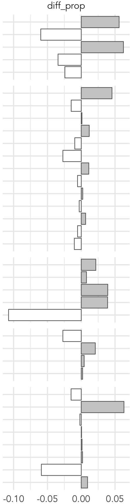

```{r setup, include=FALSE, echo=FALSE}
options(htmltools.dir.version = FALSE)
knitr::opts_chunk$set(comment = "")
library(tidyverse)
library(here)
library(knitr)
library(kableExtra)
```


## Targeted Marketing

*df.*
> Use of data and analytics to **characterise** customer populations, such that groups of customers likely to **respond best** to a message can be targeted and marketing **messages** can be **personalised** according to customer group

---

## Targeted Marketing: Recommender systems


.xtiny-font[
Linden, G., Smith, B. and York, J. (2003) Amazon.com Recommendations: Item-to-Item Collaborative Filtering, IEEE Internet Computing,   7(1): 76-80
]
</img>


.tiny-font[
* Content or behvaioural based recommender systems
  + generate probabilities that user will like a product based on past behaviour
  + e.g. Spotify recommending tracks]

<br>
.tiny-font[
* Demographic based recommender systems
    + generate probabilities that user will like content based on the past behaviour of similar users
    + e.g. Facebook directing adds/features
]

???

Demographic assumes similar people have similar preferences/behaviours

More data available, the better these algorithms are at recommending.
That data are being collected continuously is really important…

This is targeted marketing as specific products are targeted as specific individuals


---

## Targeted Marketing: Political micro-targeting

.tiny-font[
*df.* micro-targeting
> A marketing strategy that capitalizes on the consumer’s demographic, psychographic, geographic, and behavioral data to predict his buying behavior, interests, opinions, and **influence** that behavior with the help of a hyper-targeted advertising strategy

>Pawha, 2018
]


</img>

</img>

???

* Aleksander Kogan made  personality-quiz app for Facebook.
* 270k installed app which allowed access to users *and* but their friends profiles.
* Stored data -- not deleted -- later provided to Cambridge Analytica  where made 30 million “psychographic” profiles of voters.
* Made and tested directly targeted ads for Leave, Ted Cruz and Trump

---

## Targeted "Marketing": Criminal justice

.small-font[
[`fivethirtyeight.com/parole-assessment-simulator/`](https://projects.fivethirtyeight.com/parole-assessment-simulator/)
]

</img>


</img>


---


## Targeted Marketing: Segmentation


.small-font[
*df.*
> Partition objects -- places, businesses, **customers** -- into groups according to shared characteristics]


.tiny-font[
* **indirect**: clearly defined, generally static
  + age
  + income
  + occupation
  + geographic location

* **direct**: defined analytically and can change
  + purchase behaviour
  + brand awareness
  + ad response]
---

## Targeted Marketing: Segmentation techniques

.tiny-font[
* **Recency-Frequency Monetary Value** (RFM)
 + quantile-based
 + 4 min read : `https://bit.ly/2KrVUia`


 * **Clustering**
  + k-means, density-based,  hierarchical
  + 11 min read : `https://bit.ly/355i01K`

* **Decision Trees**
  + chaid, cart, id3
  + 17 min read : `https://bit.ly/35aCXbG`
  + visual introduction : `https://bit.ly/3dZJyNn`
]

???

Three categories for consumer analytics
No time for all of these -- blog posts that give really nice high-level summaries.

RFM and Clustering : unsupervised grouping.

Decision Trees : supervised learning -- clear output variable is labelled to to guide grouping process.


---

## Targeted Marketing: Geodemographics

.tiny-font[
*Geodemographic clustering df.*
> Partition neighbourhoods, small areas, into groups according to their demographic characteristics such that
neighbourhoods within groups are demographically similar and neighbourhoods between groups are demographically different]

<a href="https://oac.datashine.org.uk/#datalayer=oac11_s&layers=BTTT&zoom=12&lon=-0.1500&lat=51.5200">
  </img>
</a>

<br><br><br><br><br><br><br><br><br>
.xtiny-font[
Leventhal, B. 2016. Geodemographics for Marketers: Using location
analysis for research and marketing. [Available online](https://leeds.primo.exlibrisgroup.com/discovery/fulldisplay?docid=alma991013055919705181&context=L&vid=44LEE_INST:VU1&lang=en&search_scope=My_Inst_CI_not_ebsco&adaptor=Local%20Search%20Engine&tab=AlmostEverything&query=any,contains,991013055919705181&sortby=date_d&facet=frbrgroupid,include,9031409011017862701&offset=0)
]
---


## Targeted Marketing: Practical


</img>
.tiny-font[
[`Assignment #1 url`](https://minerva.leeds.ac.uk/webapps/blackboard/content/listContentEditable.jsp?content_id=_7983616_1&course_id=_521220_1&mode=reset)]

---

## Targeted Marketing: Practical


</img>
.tiny-font[
[`Assignment #1 url`](https://minerva.leeds.ac.uk/webapps/blackboard/content/listContentEditable.jsp?content_id=_7983616_1&course_id=_521220_1&mode=reset)]

---

## Targeted Marketing: Practical

</img>
---

## Targeted Marketing: Practical


</img>
</img>
</img>
</img>

???

Respond in certain ways -- more efficient

---


## Targeted Marketing: Practical

</img>
---


## Mapping survey variables in `ggplot2`

.tiny-font[Read in boundary data:]
.xtiny-font[
```{r boundary-prep, eval=FALSE, echo=TRUE, out.width="100%"}

# Read in geojson files defining OAs and wards in Leeds
oa_boundaries <- st_read("./data/oa_boundaries.geojson", crs=27700)
ward_boundaries <- st_read("./data/ward_boundaries.geojson", crs=27700)


glimpse(oa_boundaries)
# Rows: 2,543
# Columns: 8
# $ oa_code    <chr> "E00056780", "E00058784", "E00058705", "E00057471", "E00057476", "E00057477", "E00057474", "E0005…
# $ supgrpcode <dbl> 1, 7, 2, 8, 6, 8, 1, 1, 8, 1, 8, 8, 8, 2, 8, 5, 2, 4, 6, 5, 1, 5, 5, 5, 2, 4, 4, 5, 5, 4, 4, 4, 6…
# $ supgrpname <chr> "Rural Residents", "Constrained City Dwellers", "Cosmopolitans", "Hard-Pressed Living", "Suburban…
# $ grpcode    <chr> "1a", "7c", "2d", "8a", "6b", "8a", "1b", "1b", "8c", "1b", "8c", "8c", "8c", "2c", "8b", "5a", "…
# $ grpname    <chr> "Farming Communities", "White Communities", "Aspiring and Affluent", "Industrious Communities", "…
# $ subgrpcode <chr> "1a2", "7c2", "2d1", "8a2", "6b4", "8a2", "1b1", "1b1", "8c3", "1b2", "8c1", "8c3", "8c3", "2c1",…
# $ subgrpname <chr> "Established Farming Communities", "Constrained Young Families", "Urban Cultural Mix", "Industrio…
# $ geometry   <POLYGON [m]> POLYGON ((416908.7 442263, ..., POLYGON ((435701 436472, 43..., POLYGON ((432747.7 436864…

```
]

---


## Targeted Marketing: Practical


</img>
</img>
</img>
</img>

???

Respond in certain ways -- more efficient

---

### Mapping survey variables in `ggplot2` : categorical

.pull-left[
.tiny-font[Plot specification for choropleth map:]
.xtiny-font[
```{r boundary-plot-1, eval=FALSE, echo=TRUE, out.width="100%"}
oa_boundaries %>%
  ggplot()+
    geom_sf(aes(fill=supgrpname), colour=NA)+
    coord_sf(crs=st_crs(oa_boundaries), datum=NA)
```
<br><br><br>
`ggplot2` form:
1. Identify *dataset*: `data=` | `<data> %>%`
2. Specify *mapping*: `aes(x=..., y=..., fill=...)`
3. Select *geometry* (or marks) layer: `geom_*`
  ]
]

.pull-right[</img>
]

---

### Mapping survey variables in `ggplot2` : categorical

.pull-left[
.tiny-font[Plot specification for choropleth map:]
.xtiny-font[
```{r boundary-plot-2, eval=FALSE, echo=TRUE, out.width="100%"}
oa_boundaries %>%
  ggplot()+
    geom_sf(aes(fill=supgrpname), colour=NA)+
    coord_sf(crs=st_crs(oa_boundaries), datum=NA) +
    scale_fill_brewer(palette="Set1")
```
 ]
]
.pull-right[</img>
]

---

### Mapping survey variables in `ggplot2` : categorical

.pull-left[
.tiny-font[Plot specification for choropleth map:]
.xtiny-font[
```{r boundary-plot-3, eval=FALSE, echo=TRUE, out.width="100%"}
oa_boundaries %>%
  ggplot()+
    geom_sf(aes(fill=supgrpname), colour=NA, alpha=.8)+
    coord_sf(crs=st_crs(oa_boundaries), datum=NA) +
    scale_fill_brewer(palette="Set1")
```
]
]
.pull-right[</img>
]

---

### Mapping survey variables in `ggplot2` : categorical

.pull-left[
.tiny-font[Plot specification for choropleth map:]
.xtiny-font[
```{r boundary-plot-4, eval=FALSE, echo=TRUE, out.width="100%"}
# constrained -- red -- #e41a1c
# cosmo -- yellow -- #ffff33
# ethnicity -- pink -- #f781bf
# hard-pressed -- blue -- #377eb8
# multi -- orange -- #ff7f00
# rural -- green -- #4daf4a
# suburb -- purple  -- #984ea3
# urban -- brown -- #a65628

oac_colours <- c("#e41a1c", "#ffff33", "#f781bf",
 "#377eb8", "#ff7f00", "#4daf4a", "#984ea3", "#a65628")

oa_boundaries %>%
  ggplot()+
    geom_sf(aes(fill=supgrpname), colour=NA, alpha=.8)+
    coord_sf(crs=st_crs(oa_boundaries), datum=NA) +
    scale_fill_manual(values=oac_colours)
```
]
]
.pull-right[</img>
]

---

### Mapping survey variables in `ggplot2` : categorical

.pull-left[
.tiny-font[Plot specification for choropleth map:]
.xtiny-font[
```{r boundary-plot-5, eval=FALSE, echo=TRUE, out.width="100%"}
oa_boundaries %>%
  mutate(is_emph= supgrpname == "Suburbanites") %>%
  ggplot()+
    geom_sf(aes(fill=supgrpname), colour=NA, alpha=.8)+
    geom_sf(
      data=. %>% filter(is_emph),
      fill="transparent", colour="#984ea3", size=0.1)+
    geom_sf(
      data=. %>% summarise(), fill="transparent",
      colour="#636363", size=0.2)+
    coord_sf(crs=st_crs(oa_boundaries), datum=NA) +
    scale_fill_manual(values=oac_colours) +
    guides(
      fill=guide_legend(title="OAC Supergroup"),
      colour=FALSE
      )
```
]
]
.pull-right[</img>
]

---


### Mapping survey variables in `ggplot2` : continuous

.xtiny-font[
```{r prep-code-cont, eval=FALSE, echo=TRUE, out.width="100%"}
temp_target_data <-
  simulated_oac_age_sex %>%
    summarise(
      oa_code=zone,
      is_target_age=as.numeric(age_band %in% c("a65over", "a35to49")),
      is_target_children=as.numeric(number_children>0),
      is_target_geodeom=as.numeric(supergroup_name=="Suburbanites"),
    ) %>%
  rowwise() %>%
  mutate(
    target_extent=sum(is_target_age,is_target_children, is_target_geodeom)
    ) %>%
  ungroup() %>%
  mutate(
      target_extent_coded=
      case_when(
        target_extent == 3 ~ "high",
        target_extent == 2 ~ "mid",
        target_extent == 1 ~ "low",
        TRUE ~ ""
        )
  ) %>%
  group_by(oa_code) %>%
  summarise(
    high=sum(as.numeric(target_extent_coded=="high")),
    mid=sum(as.numeric(target_extent_coded=="mid")),
    low=sum(as.numeric(target_extent_coded=="low")),
    index=sum(target_extent)
  )
```
]

---


### Mapping survey variables in `ggplot2` : continuous

.pull-left[
.tiny-font[Plot index as choropleth map:]
.xtiny-font[

```{r plot-index, eval=FALSE, echo=TRUE, out.width="100%"}
    oa_boundaries %>%
      left_join(temp_target_data) %>%
      ggplot()+
        geom_sf(aes(fill=index), colour=NA)+
        geom_sf(
          data=. %>% summarise(), fill="transparent",
          colour="#636363", size=0.2)+
        coord_sf(crs=st_crs(oa_boundaries), datum=NA)+
        scale_fill_distiller(palette="Blues", direction=1)
```
    ]
]
.pull-right[</img>
]
---

### Mapping survey variables in `ggplot2` : continuous


.pull-left[
.tiny-font[Plot high-mid-low as choropleth map:]
.xtiny-font[

```{r plot-hlm, eval=FALSE, echo=TRUE, out.width="100%"}
oa_boundaries %>%
left_join(temp_target_data  %>%
          pivot_longer(
            cols=c(high, mid, low),
            names_to="target_extent",
            values_to="count")
        ) %>%
mutate(
  target_extent=
  factor(target_extent, levels=c("high","mid","low"))
) %>%
ggplot()+
  geom_sf(aes(fill=count), colour=NA)+
  geom_sf(data=. %>% summarise(),
    fill="transparent", colour="#636363", size=0.2)+
  coord_sf(crs=st_crs(oa_boundaries), datum=NA)+
  scale_fill_distiller(palette="Blues", direction=1)+
  facet_wrap(~target_extent, nrow=3)
```
    ]
]
.pull-right[</img>
]

---

## Module Schedule

```{r outline, echo=FALSE, out.width="100%"}
outline <- tibble::tibble(
  session = c("1", "2", "3", "4", "5"),
  wc =c("21 Jun", "28 Jun", "5 Jul", "12 Jul", "19 Jul"),
  academic=c("RB","RB", "JG/NM", "RO/RB", "RB/JG/NM/RO"),
  lecture = c("Predictive analytics & microsimulation", "Response modelling and targeted marketing", "Behavioural and agent-based models",
  "Coursework surgery", "Guest lecture and wrap-up"),
  progress=c("#1 data","#1 analysis","#2 material","#1 surgery","#2 surgery")
)
kbl(outline) %>%
  row_spec(0, background = "#ffffff", font_size = 18 ) %>%
  row_spec(1:5, background = "#ffffff", font_size=20) %>%
  row_spec(c(1,2,3,5), color="#616161")
```
