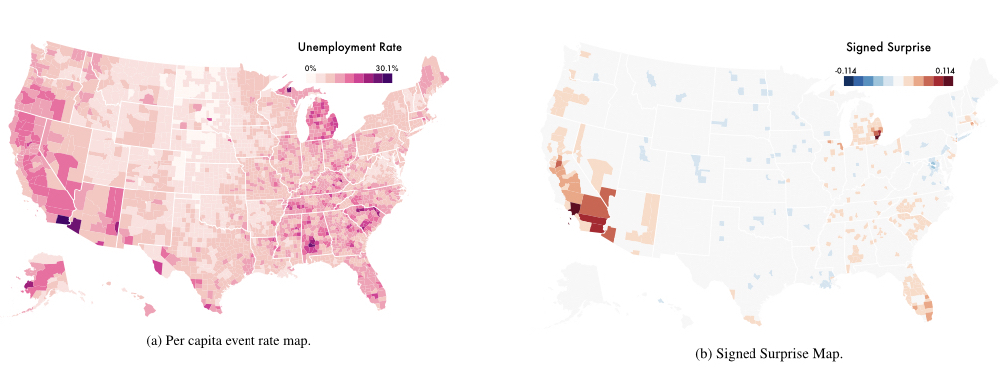
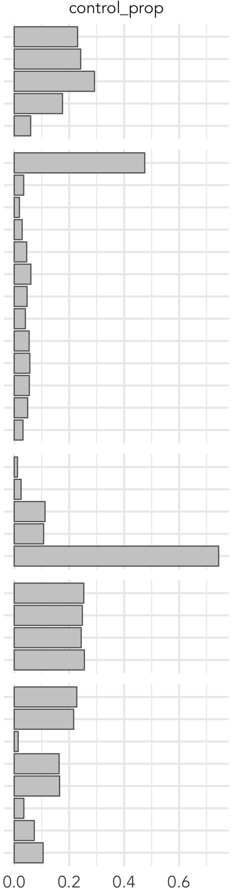
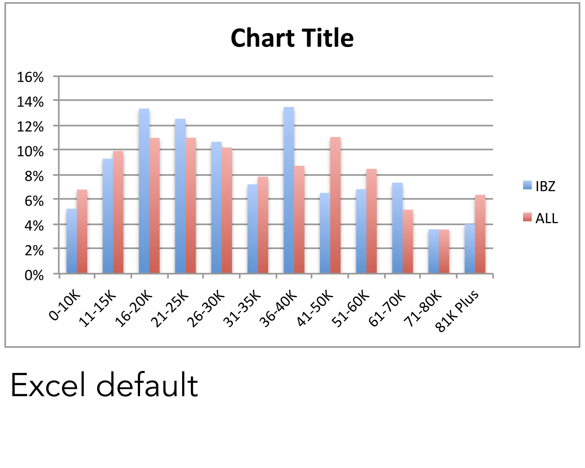
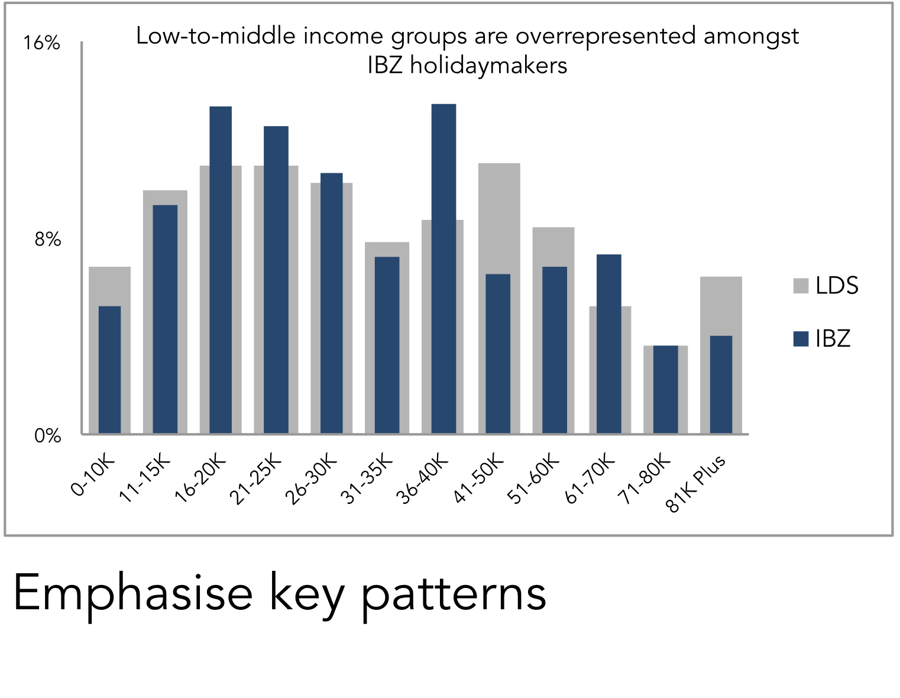
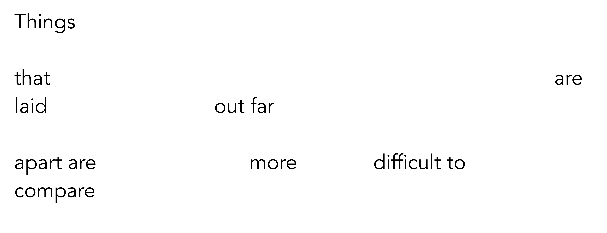

```{r setup, include=FALSE, echo=FALSE}
options(htmltools.dir.version = FALSE)
knitr::opts_chunk$set(comment = "")
library(tidyverse)
library(here)
library(knitr)
library(kableExtra)
```


## Module Schedule

```{r outline, echo=FALSE, out.width="100%"}
outline <- tibble::tibble(
  session = c("1", "2", "3", "4", "5"),
  wc =c("28 Feb", "7 Mar", "14 Mar", "21 Mar", "25 Apr"),
  academic=c("RB","RB", "RO", "JG/NM", "JG/NM"),
  lecture = c("Simulating behaviour", "Targeted marketing", "Machine learning",
  "Agent-based models", "Close"),
  deadline=c("","","","Ass 1","Ass 2")
)
kbl(outline) %>%
  row_spec(0, background = "#ffffff", color="#616161", font_size = 18 ) %>%
  row_spec(1:4, background = "#ffffff", font_size=20, color="#616161") %>%
  row_spec(5, background = "#ffffff", font_size=20)
```

???

* Give a quick recap/reflection over the module
* Assignment 2 and presentations more generally
* Module survey/evaluation


---


## Module content and philosophy


* Spatial modelling to simulate and predict consumer behaviour
  + Exploratory analysis
  + Microsimulation
  + Agent-based modelling

<br>

* Research case studies to evaluate modelling techniques in practice
  + Practical sessions
  + Individual data science report
  + Group data science presentation

???
* Introduced some key theory and techniques in modern data analysis.
* Both technical and applied aspects.
* Techniques in which Geog dept specialises
* Doing so with datasets and domains relevant to marketing science

---


## Outcomes

By the end of this module you should be able to:

1. **Explain** and **critically evaluate** the role of spatial analytics in simulating and predicting consumer behaviours

2. **Apply** geocomputational modelling and simulation techniques on real data sets

3. **Devise** and **employ** spatial modelling tools to address business problems, presenting and justifying recommendations in an appropriate context

--

`-----------`

microsimulation | random forests | abms

???

1 : theory
2 : application
3 : both

---

## Spatial microsimulation


.pull-left[.right[
`Survey data`
.small-font[
individual-level and rich in detail <br>
small sample and may be biased
]]
]

</img>


<br><br><br><br><br><br><br>

.pull-right[.left[
`Census data`
.small-font[
high-level and low in detail <br>
population-level and complete
]]
]

</img>


???

Many situations where interested in knowing population that lives in an area: interests, preferences, spending patterns

Are population-level datasets that exist.:

Census is amazing for counting people according to high-level characteristics...

But we only have a limited set of attribute information.

Lots missed off from it – commercial setting – interests and preferences.

Instead -- rely on comparatively small sample survey data for studying interests and preferences.

Spatial microsimulation allows us to match rich individual-level data to a population we know less about.


---

## Random forests 

</img>
</img>

---

## Agent-based models

</img>


---

## Fundamentals of (modern) data analysis

--
* Data analysis is
  +  A careful thinking about evidence (data) in the context of a research problem

--


* Data analysis involves
 + **Defining** your problem
 + **Identifying** relevant data
 + **Winnowing** on data | techniques | problem-space
 + **Evaluating** implied patterns under uncertainty


???

these are the sorts of things that you will be doing in dissertations

---

## Fundamentals of (modern) data analysis

<br>
.small-font[**Deviation** from **Expectation**]

</img>

<br><br><br><br><br><br><br><br>
.xtiny-font[Correll & Heer (2017) Surprise! Bayesian Weighting for De-Biasing Thematic Maps, IEEE TVCG]


---
## Fundamentals of (modern) data analysis

</img>
--
</img>
--
</img>
</img>

---
## Fundamentals of (modern) data analysis

 </img>

---

## Fundamentals of (modern) data analysis

 </img>


---

## Fundamentals of (modern) data analysis

 </img>


---

## Fundamentals of (modern) data analysis

 </img>


---

## Fundamentals of (modern) data analysis

 </img>


---

## Assignment #2

--
### Guidelines for effective presentations (slides)

---


## Assignment #2

### Guideline 1: Avoid noise

--
.small-font[
* Background colours

* Logos

* Overly small font

* Too much text

* Unnecessary transitions
]

---


## Assignment #2

### Guideline 1: Avoid noise

--

</img>

--

</img>

--

</img>

--

</img>

--

</img>


---

## Assignment #2

### Guideline 1: Avoid noise

</img>
</img>


---

## Assignment #2

### Guideline 2: Refine
<br>
> .small-font[
*With each slide,* <br>
*convey one message (only)*]

???

Very easy to load slides with content.
Try to be judicious with the message.

---

## Assignment #2

### Guideline 3: Reduce
<br>
> .small-font[
*Be concise,* <br>
*both verbally and visually*]

???

Say what you want to say with the least number of words.

---

## Assignment #2

### Guideline 4: Compliment
<br>
> .small-font[
*Slides should display things that* <br>
*can’t be easily spoken*]

???

Say what you want to say with the least number of words.

---

## Assignment #2

### Guideline 5: Layout

--
</img>
--
</img>

???

Do think about ordering your slides meaningfully : layout is powerful.

---

## Assignment #2

### Guideline 5: Layout

--
</img>


---
## Assignment #2

### Guideline 5: Layout

</img>

---
## Assignment #2

### Guideline 5: Layout - order


<br>
.small-font[
> *We expect things to be displayed
    in sequence.*]
--
.small-font[
> *If we wish to imply a sequence,
     arrange things in that sequence.*]
--
.small-font[
> *This  can be particularly useful when ‘telling a story’ in a presentation.*
]

???

We expect a story, a sequence

We can imply that sequence in our presentations by ordering slides and charts

Doing so allows us to tell data stories.


---

## Assignment #2

### Jean-Luc Doumont

<div class="embed-responsive embed-responsive-16by9">
<iframe width="500" height="350" class="embed-responsive-item" src="https://www.youtube.com/embed/meBXuTIPJQk" frameborder="0" allow="accelerometer; autoplay; encrypted-media; gyroscope; picture-in-picture" allowfullscreen></iframe>
</div>

<!-- </img> -->
---


 </img>
<br><br><br><br><br><br><br><br><br><br><br><br><br><br><br>
`https://leeds.bluera.com/leeds/`

???

* opened today
* automatic e-mail reminders
* useful for updating content : initially this module used peculiar software drag and drop (no code), moved to R in response to feedback
* do try to be specific / direct /  focussed with comments --- and think carefully about expectations of you as MSc students
