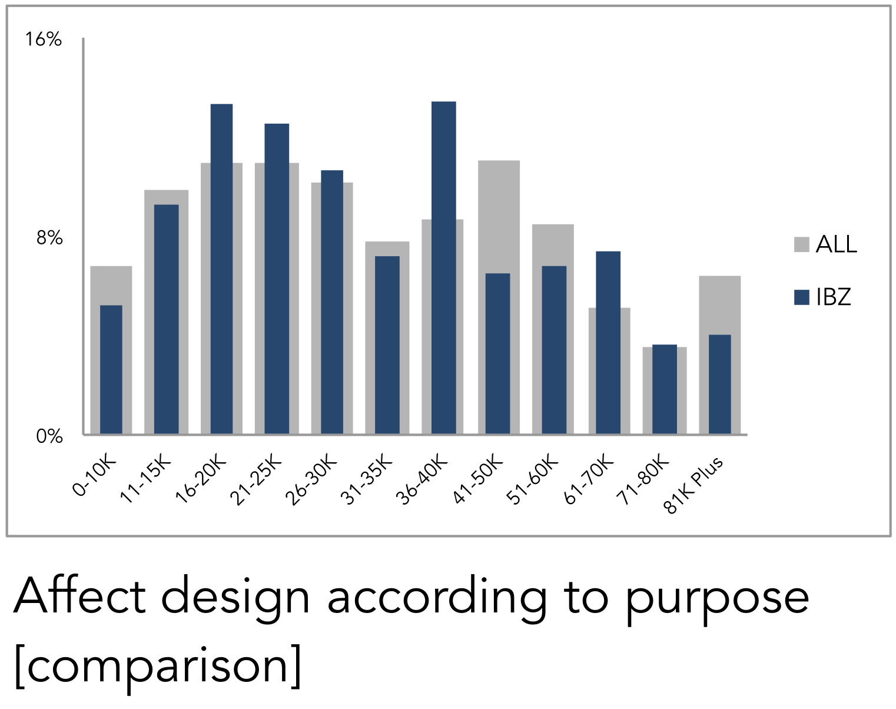
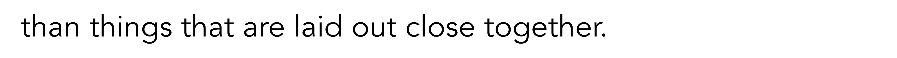
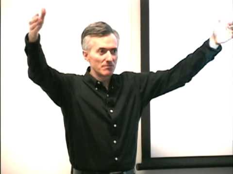

```{r setup, include=FALSE, echo=FALSE}
options(htmltools.dir.version = FALSE)
knitr::opts_chunk$set(comment = "")
library(tidyverse)
library(here)
library(knitr)
library(kableExtra)
```


## Module Schedule

```{r outline, echo=FALSE, out.width="100%"}
outline <- tibble::tibble(
  session = c("1", "2", "3", "4", "5"),
  wc =c("28 Feb", "7 Mar", "14 Mar", "21 Mar", "25 Apr"),
  academic=c("RB","RB", "RO", "JG/NM", "JG/NM"),
  lecture = c("Simulating behaviour", "Targeted marketing", "Machine learning",
  "Agent-based models", "Close"),
  deadline=c("","","","Ass 1","Ass 2")
)
kbl(outline) %>%
  row_spec(0, background = "#ffffff", color="#616161", font_size = 18 ) %>%
  row_spec(1:5, background = "#ffffff", font_size=20) %>%
  column_spec(1:4, color="#616161")
```

---


## Assignment #2

--
### Guidelies for effective presentations (slides)

---


## Assignment #2

### Guideline 1: Avoid noise

--
.small-font[
* Background colours

* Logos

* Overly small font

* Too much text

* Unnecessary transitions
]

---


## Assignment #2

### Guideline 1: Avoid noise

--

</img>

--

</img>

--

</img>

--

</img>

--

</img>


---

## Assignment #2

### Guideline 1: Avoid noise

</img>
</img>


---

## Assignment #2

### Guideline 2: Refine
<br>
> .small-font[
*With each slide,* <br>
*convey one message (only)*]

???

Very easy to load slides with content.
Try to be judicious with the message.

---

## Assignment #2

### Guideline 3: Reduce
<br>
> .small-font[
*Be concise,* <br>
*both verbally and visually*]

???

Say what you want to say with the least number of words.

---

## Assignment #2

### Guideline 4: Compliment
<br>
> .small-font[
*Slides should display things that* <br>
*can’t be easily spoken*]

???

Say what you want to say with the least number of words.

---

## Assignment #2

### Guideline 5: Layout

--
</img>
--
</img>

???

Do think about ordering your slides meaningfully : layout is powerful.

---

## Assignment #2

### Guideline 5: Layout

--
</img>


---
## Assignment #2

### Guideline 5: Layout

</img>

---
## Assignment #2

### Guideline 5: Layout - order


<br>
.small-font[
> *We expect things to be displayed
    in sequence.*]
--
.small-font[
> *If we wish to imply a sequence,
     arrange things in that sequence.*]
--
.small-font[
> *This  can be particularly useful when ‘telling a story’ in a presentation.*
]

???

We expect a story, a sequence

We can imply that sequence in our presentations by ordering slides and charts

Doing so allows us to tell data stories.


---

## Assignment #2

### Jean-Luc Doumont

<div class="embed-responsive embed-responsive-16by9">
<iframe width="500" height="350" class="embed-responsive-item" src="https://www.youtube.com/embed/meBXuTIPJQk" frameborder="0" allow="accelerometer; autoplay; encrypted-media; gyroscope; picture-in-picture" allowfullscreen></iframe>
</div>

<!-- </img> -->
