```{r setup, include=FALSE, echo=FALSE}
options(htmltools.dir.version = FALSE)
knitr::opts_chunk$set(comment = "")
library(tidyverse)
library(here)
library(knitr)
library(kableExtra)
```


## Module Schedule

```{r outline, echo=FALSE, out.width="100%"}
outline <- tibble::tibble(
  session = c("1", "2", "3", "4", "5"),
  wc =c("28 Feb", "7 Mar", "14 Mar", "21 Mar", "25 Apr"),
  academic=c("RB","RB", "RO", "JG/NM", "JG/NM"),
  lecture = c("Simulating behaviour", "Targeted marketing", "Machine learning",
  "Agent-based models", "Close"),
  deadline=c("","","","Ass 1","Ass 2")
)
kbl(outline) %>%
  row_spec(0, background = "#ffffff", color="#616161", font_size = 18 ) %>%
  row_spec(1:5, background = "#ffffff", font_size=20) %>%
  column_spec(1:4, color="#616161")
```

---


## Assigment #1

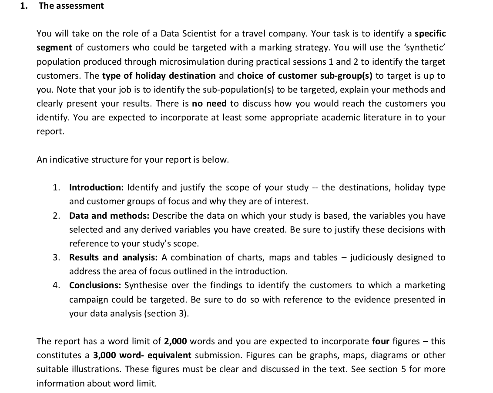</img>
.tiny-font[
[`Assignment #1 url`](https://minerva.leeds.ac.uk/webapps/blackboard/content/listContentEditable.jsp?content_id=_7983616_1&course_id=_521220_1&mode=reset)]

???

Different from the workbook activities required by GDVA.

What I’m looking for :
	General 1 : A well-scoped data analysis. Data you select, techniques use to analyse it and presentation makes sense given your focus.
	General 2 : That  all analysis and recommendations are evidence-based – that is they are clearly informed by your data analysis.

<!-- ---


## Assigment #1

.small-font[
`individuals.csv`
  `15,189 records`
  <br>
  `--------`
  <br>
  `simulated_oac_age_sex.csv`
    `320,596 records`
]
</img>


Remember : we’ve got this simulated population-level dataset.
Each row is a household in Leeds that have recently returned from holiday — thought where certain areas in Leeds are better characterised than others -->

<!-- ---


## Assigment #1

.small-font[Identify and profile a target market using:]

 .tiny-font[
* **Demographics**
   + income, age, household structure

* **Geography**
   + where and what types of areas they tend to live in

* **Psychographics**
    +  their motivations and preferences
]


1. Define group of interest -- destination type / customer type
2. Identify what makes those holidaying there distinctive
3. So that can target in particular ways

Of interest:

* demographics : what types of people in terms of income, age profile?
* geography : where those individuals live (heavily related to demogs)?
* psychographics : their preferences, motivations and more subjective tastes -->

<!-- ## Assigment #1

`simulated_oac_age_sex.csv`
  `320,596 records`

  ```{r survey-data, echo=FALSE, out.width="100%"}
  team <- tibble::tibble(
    var_name = c("age_band", "income_band", "oac_grp", "uk_airport", "overseas_airport", "satisfaction_overall"),
    var_values = c("a24under, ...", "11-15k, ...", "1,2,3,...", "MAN, DSA, ...","TFS, EFL, ...", "1_poor, ..."),
    var_type = c("demographic", "demographic", "geodemographic", "preference", "preference", "preference/attitude")
  )
  kbl(team) %>%
    row_spec(0, background = "#ffffff", font_size = 18) %>%
    row_spec(1:6, background = "#ffffff", font_size = 16)
  ```


--- -->


<!-- ## Assigment #1


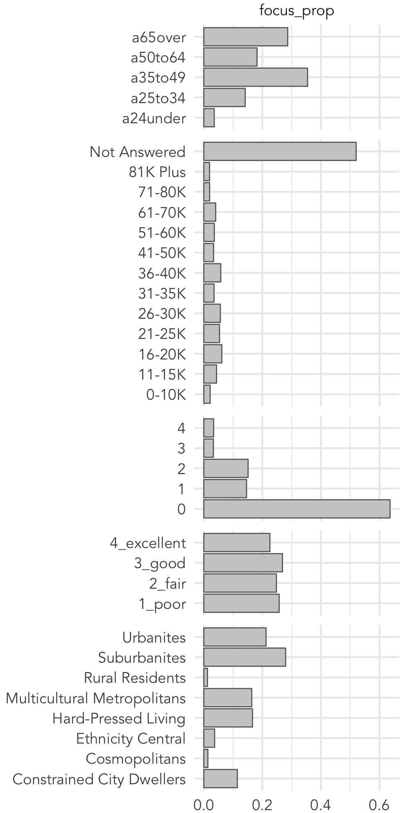</img>
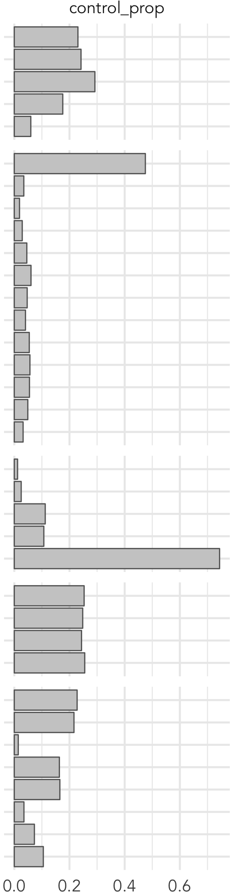</img>
</img>

--- -->

<!-- ## Assigment #1


</img>
</img>
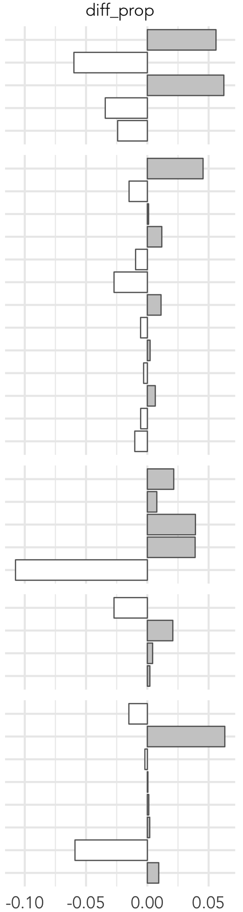</img>
</img>

--- -->

<!-- ## Assigment #1

<br>
.small-font[**Deviation** from **Expectation**]

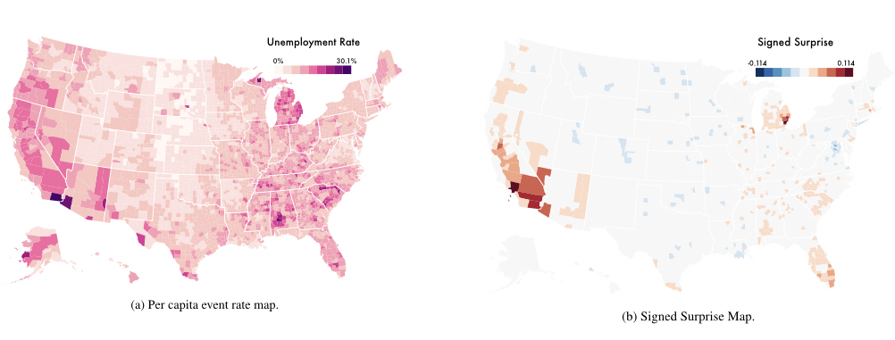</img>

<br><br><br><br><br><br><br>
.xtiny-font[Correll & Heer (2017) Surprise! Bayesian Weighting for De-Biasing Thematic Maps, IEEE TVCG]


--- -->

---

## Assigment #1

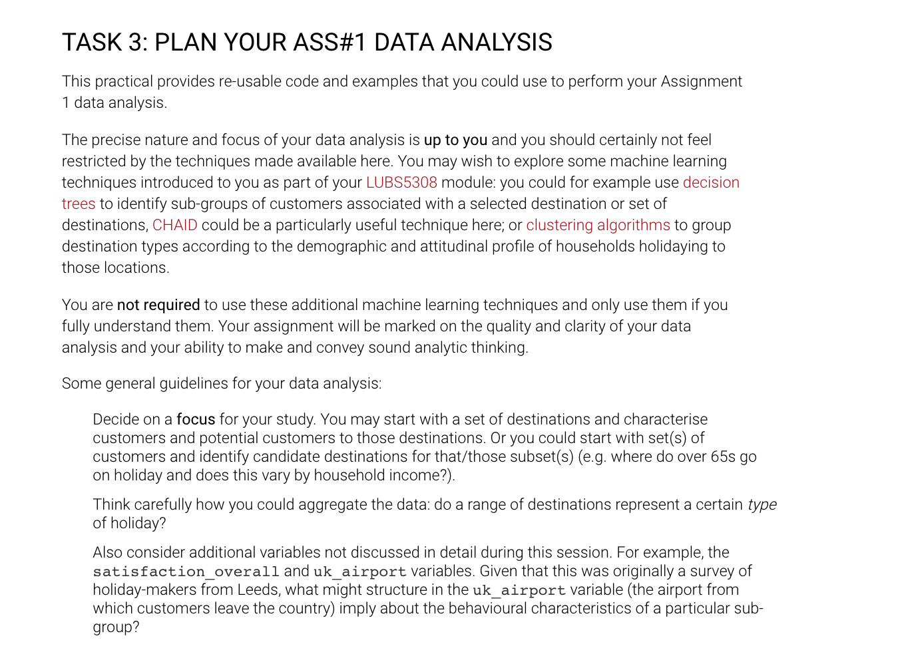</img>
---


## Assigment #1

### FAQs

--
> "I selected holidays to `<insert-destination-name-here>` as a focus for my data analysis. Is this *correct*?"


???

Entirely up to you.
Expect you to consider things like whether you have enough data to make claims with certainty.
E.G. India.

Also you will want to consider data available. high-level focus : single demographic group (age under 35 for example) OR category of location (all holidays to Africa for example).  Selecting both a destination and demographic type as your focus; or a focus that is based on multiple variables (OAC and age and income for example) limits the analysis that you can do as it effectively eliminates the variables on which you are selecting the focus from your data analysis.

---

### FAQs

> "I found that `<insert-variable-value-combination-here>` were overrepresented amongst my area of focus when compared against my baseline. Should I just list each of these?"


???

Again -- interested in your demonstrating understanding and an ability to reason over data -- this what is required of data scientists.
E.g. -- Consider *effect size*, *variability*.
E.g. -- income variable.
E.g. -- ethnicity central.

---

### FAQs

> "What does `diff_prop` mean?"

???

There is nothing sophisticated happening here – the “diff_prop” bars are simply comparing two proportions:

Of all PMI holidaymakers in Leeds population, the proportion that are 65+; 50-64; etc.
Of all holidaymakers in Leeds population, the proportion that are 65+; 50-64; etc.

So if a larger proportion of 65+ in the PMI group than the Leeds population, then one can say that age category is overrepresented when compared against our expectation that PMI holidaymakers are no different from the Leeds population.


Also up to you to decide on what is important

---

### FAQs

> "In the session 2 recap you showed how to creat a choropleth map in `ggplot2`. What does `index` mean -- and `high`- `mid`- `low`?"

???

* Quickly generated in response to student request.
* Different ways of cutting the data possible.
* Not required to produce a map as an output for  submission.

* High-mid-low: “propensity”-type measure. Identify  variables discriminating (from my earlier analysis) for holidaymakers to IBZ. Then I identify individuals in each output area (small areas in Leeds to which individuals in our microsimulated data are assigned) that have one (low), two (medium), three (high) of those characteristics and give them a score accordingly.

* Index -- “weighted count”. Greater weight to higher “propensity” Arbitrary – are those that are “suburbanites” AND “a65over” twice as important (in terms of marketing) as those that are just “a65over” and note “suburbanites? Made sense to continue this into the overall index score.  Map of *index*  shows small areas (output areas) that contain our target individuals. The high-medium-low provide further detail:  “high” map is those areas containing individuals who are most likely to respond to an ad campaign for IBZ holidays (in this case) as we assume believe them to share common demographic characteristics with IBZ holidaymakers; the mid-map contains those likely to respond based on two shared characteristics; the low map shows those *likely* to respond based on one characteristic


---

### FAQs

> "What do I write in each section of the report?"

> "Why do I have a Results section and Conclusion section?"

> "In which section should I put `x`, `y` and `z`?"


---

## Assigment #1

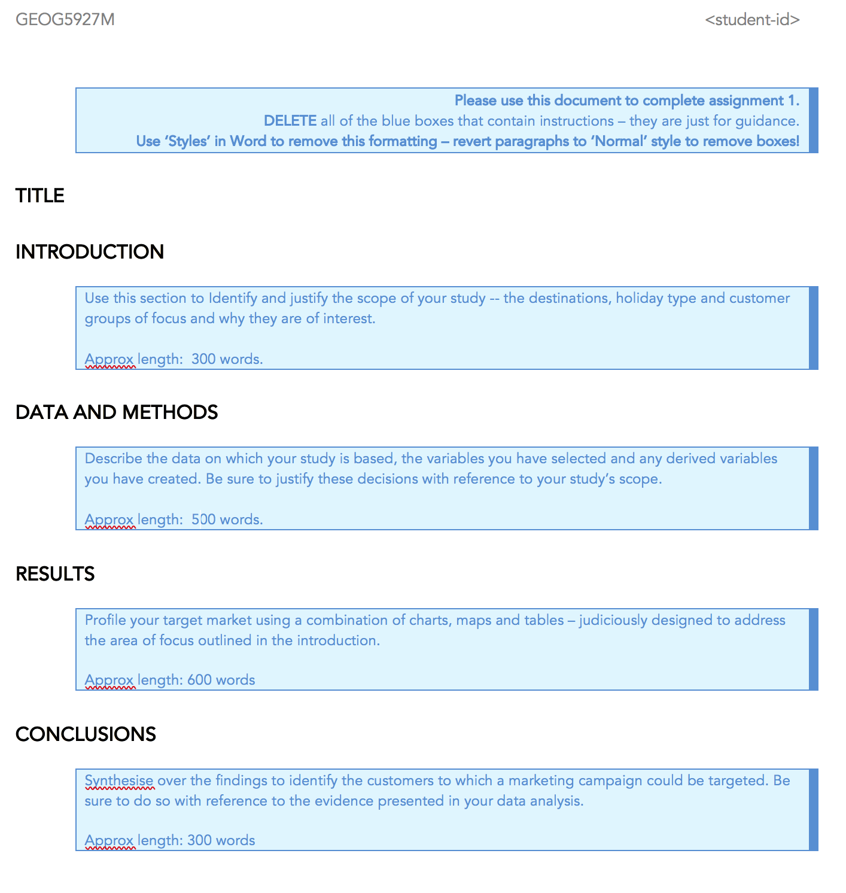</img>
.tiny-font[
[`Assignment #1 url`](https://minerva.leeds.ac.uk/webapps/blackboard/content/listContentEditable.jsp?content_id=_7983616_1&course_id=_521220_1&mode=reset)]

???

What I’m looking for :
	General 1 : A well-scoped data analysis. Data you select, techniques use to analyse it and presentation makes sense given your focus.
	General 2 : That  all analysis and recommendations are evidence-based – that is they are clearly informed by your data analysis.

---

## Assigment #1

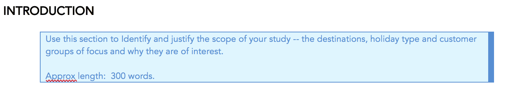</img>
.tiny-font[
[`Assignment #1 url`](https://minerva.leeds.ac.uk/webapps/blackboard/content/listContentEditable.jsp?content_id=_7983616_1&course_id=_521220_1&mode=reset)]

???

  Data and methods:
    High-level understanding of what is spatial microsimulation, why do it, and -- briefly -- how.
    You may wish to comment on whether there are particular areas not so well-represented.
  Results:
    May be appropriate to identify limitations of specific findings
  Conclusion: also in conclusion
---


## Assigment #1

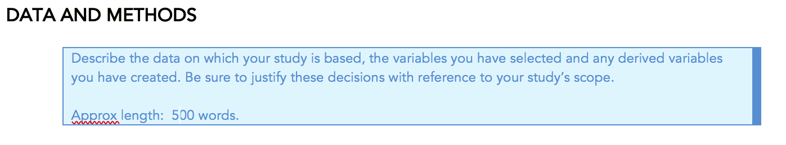</img>
.tiny-font[
[`Assignment #1 url`](https://minerva.leeds.ac.uk/webapps/blackboard/content/listContentEditable.jsp?content_id=_7983616_1&course_id=_521220_1&mode=reset)]

???

  Data and methods:
    High-level understanding of what is spatial microsimulation, why do it, and -- briefly -- how.
    You may wish to comment on whether there are particular areas not so well-represented.
---

## Assigment #1

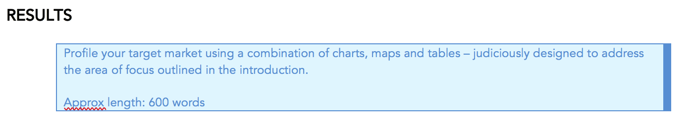</img>
.tiny-font[
[`Assignment #1 url`](https://minerva.leeds.ac.uk/webapps/blackboard/content/listContentEditable.jsp?content_id=_7983616_1&course_id=_521220_1&mode=reset)]

???

  Results:
    May be appropriate to identify limitations of specific findings
---

## Assigment #1

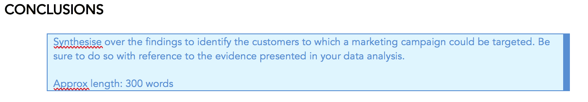</img>
.tiny-font[
[`Assignment #1 url`](https://minerva.leeds.ac.uk/webapps/blackboard/content/listContentEditable.jsp?content_id=_7983616_1&course_id=_521220_1&mode=reset)]

???

  Results:
    Also in conclusion
---

## Assigment #2

--
### Guidelies for effective presentations (slides)

---


## Assigment #2

### Guideline 1: Avoid noise

--
.small-font[
* Background colours

* Logos

* Overly small font

* Too much text

* Unnecessary transitions
]

---


## Assigment #2

### Guideline 1: Avoid noise

--

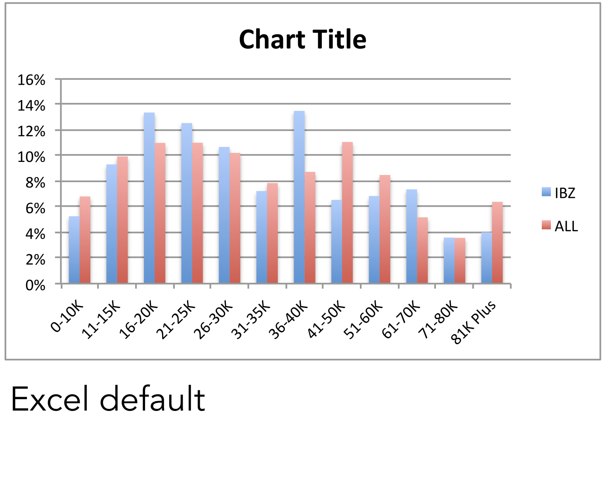</img>

--

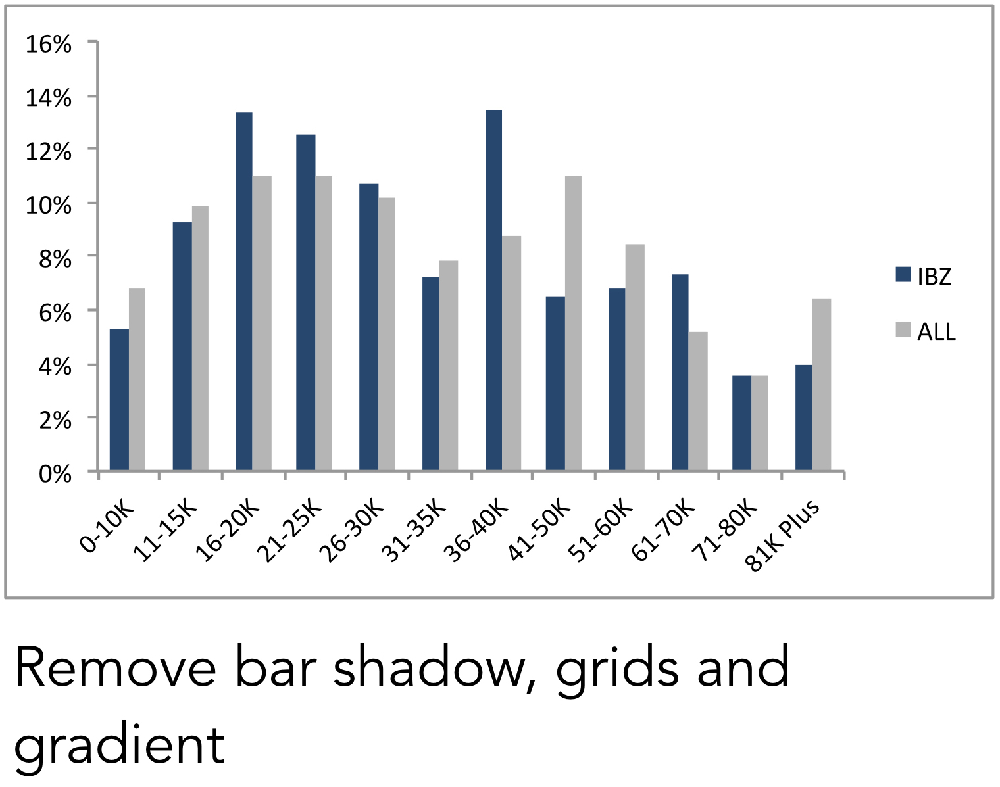</img>

--

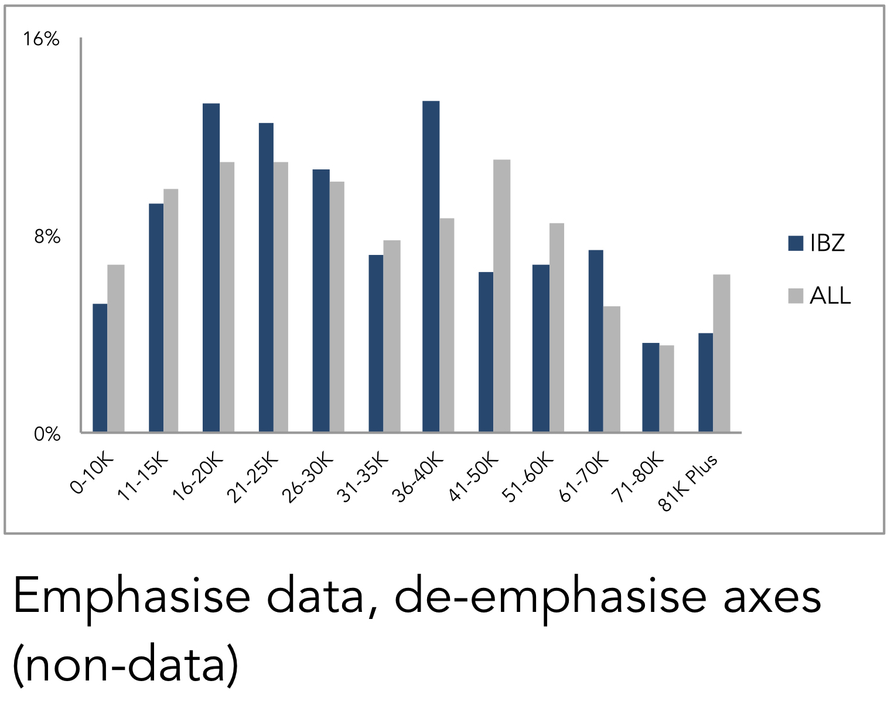</img>

--

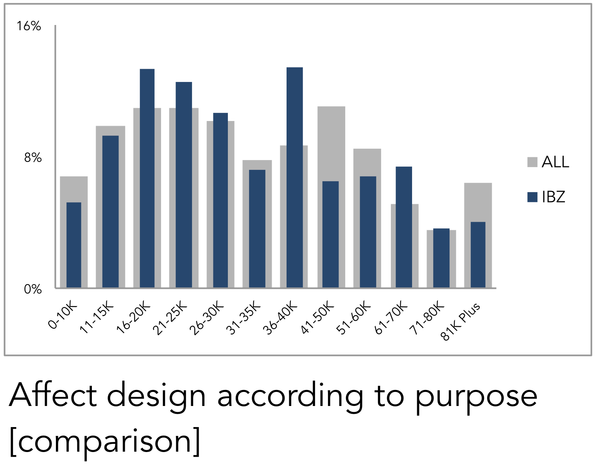</img>

--

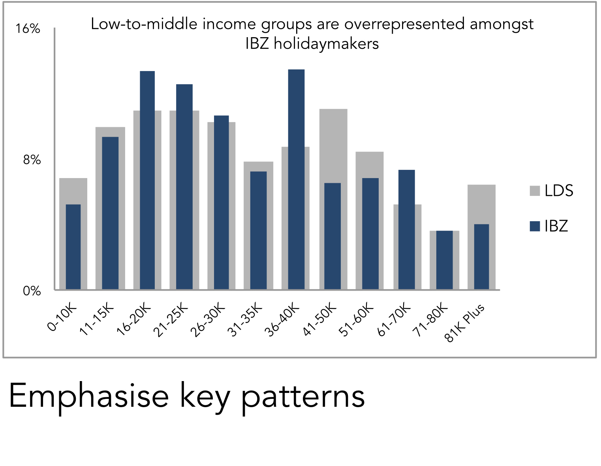</img>


---

## Assigment #2

### Guideline 1: Avoid noise

</img>
</img>


---

## Assigment #2

### Guideline 2: Refine
<br>
> .small-font[
*With each slide,* <br>
*convey one message (only)*]

???

Very easy to load slides with content.
Try to be judicious with the message.

---

## Assigment #2

### Guideline 3: Reduce
<br>
> .small-font[
*Be concise,* <br>
*both verbally and visually*]

???

Say what you want to say with the least number of words.

---

## Assigment #2

### Guideline 4: Compliment
<br>
> .small-font[
*Slides should display things that* <br>
*can’t be easily spoken*]

???

Say what you want to say with the least number of words.

---

## Assigment #2

### Guideline 5: Layout

--
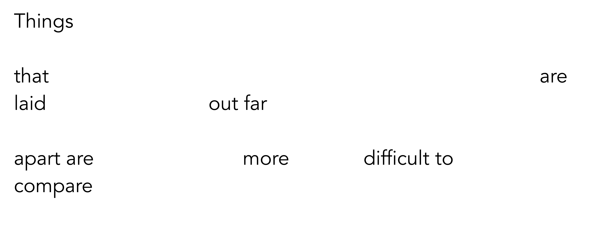</img>
--
</img>

???

Do think about ordering your slides meaningfully : layout is powerful.

---

## Assigment #2

### Guideline 5: Layout

--
</img>


---
## Assigment #2

### Guideline 5: Layout

</img>

---
## Assigment #2

### Guideline 5: Layout - order


<br>
.small-font[
> *We expect things to be displayed
    in sequence.*]
--
.small-font[
> *If we wish to imply a sequence,
     arrange things in that sequence.*]
--
.small-font[
> *This  can be particularly useful when ‘telling a story’ in a presentation.*
]

???

We expect a story, a sequence

We can imply that sequence in our presentations by ordering slides and charts

Doing so allows us to tell data stories.


---

## Assigment #2

### Jean-Luc Doumont

<div class="embed-responsive embed-responsive-16by9">
<iframe width="500" height="350" class="embed-responsive-item" src="https://www.youtube.com/embed/meBXuTIPJQk" frameborder="0" allow="accelerometer; autoplay; encrypted-media; gyroscope; picture-in-picture" allowfullscreen></iframe>
</div>

<!-- </img> -->
