```{r setup, include=FALSE, echo=FALSE}
options(htmltools.dir.version = FALSE)
knitr::opts_chunk$set(comment = "")
library(tidyverse)
library(here)
library(knitr)
library(kableExtra)
```

## Simulating behaviour practical


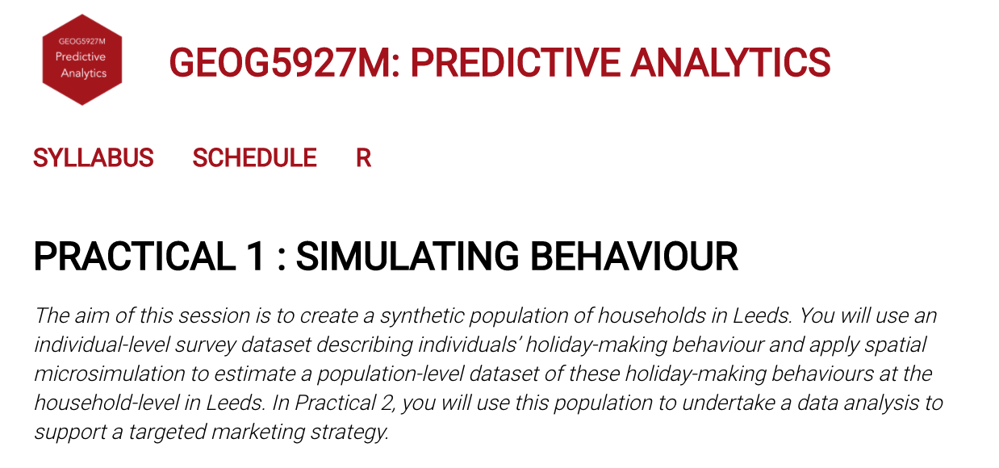</img>


--

.tiny-font[
Assumes an understanding of:
* `dplyr` for data processing and shaping
* `ggplot2` for charting

... But don't worry:
* Much of the code required to complete the practical is provided
* The assessment tests ability to present a coherent data analysis, not your ability to code in `R`
]

---


## Simulating behaviour practical: survey dataset

<br>

`individuals.csv`
  `15,189 records`

  ```{r survey-data, echo=FALSE, out.width="100%"}
  team <- tibble::tibble(
    var_name = c("age_band", "income_band", "oac_grp", "uk_airport", "overseas_airport", "satisfaction_overall"),
    var_values = c("a24under, ...", "11-15k, ...", "1,2,3,...", "MAN, DSA, ...","TFS, EFL, ...", "1_poor, ..."),
    var_type = c("demographic", "demographic", "geodemographic", "preference", "preference", "preference/attitude")
  )
  kbl(team) %>%
    row_spec(0, background = "#ffffff", font_size = 18) %>%
    row_spec(1:6, background = "#ffffff", font_size = 16)
  ```

---


## Simulating behaviour practical : use case


</img>


---


## Simulating behaviour practical : use case


</img>


---
## Simulating behaviour practical : use case

.small-font[
`individuals.csv`
  `15,189 records`
  <br>
  `--------`
]
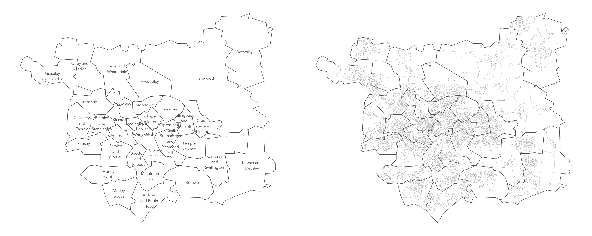</img>


---

## Spatial microsimulation


.pull-left[.right[
`Survey data`
.small-font[
individual-level and rich in detail <br>
small sample and may be biased
]]
]

</img>


<br><br><br><br><br><br><br>

.pull-right[.left[
`Census data`
.small-font[
high-level and low in detail <br>
population-level and complete
]]
]

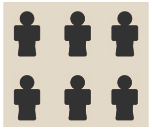</img>


---

## Spatial microsimulation

<br><br><br>
.small-font[
> *The creation, analysis and modelling of individual-level data allocated to geographic zones.*
>
> Lovelace & Dumont 2016
]


---

## Spatial microsimulation

<br><br><br>
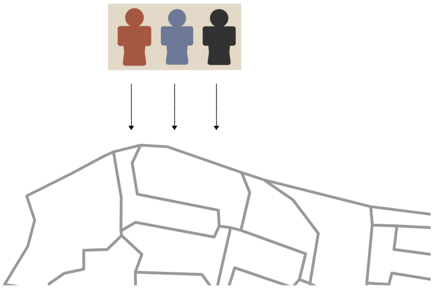</img>

---


## Spatial microsimulation

<br><br><br>
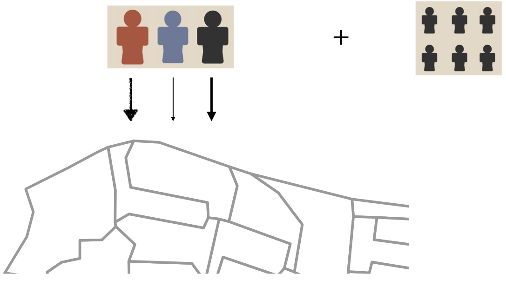</img>

---

## Spatial microsimulation

<br><br><br><br><br><br>
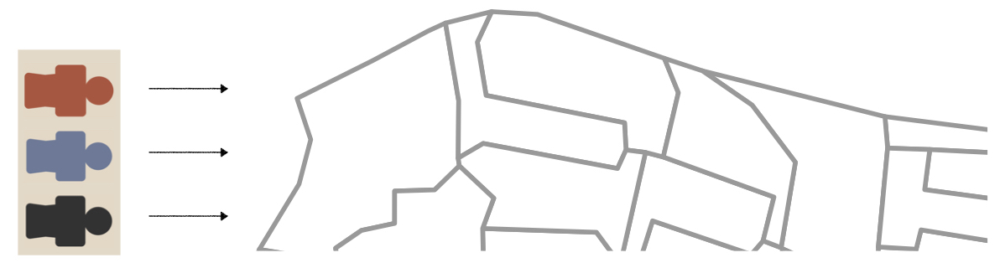</img>

---


## Spatial microsimulation

<br><br><br><br>
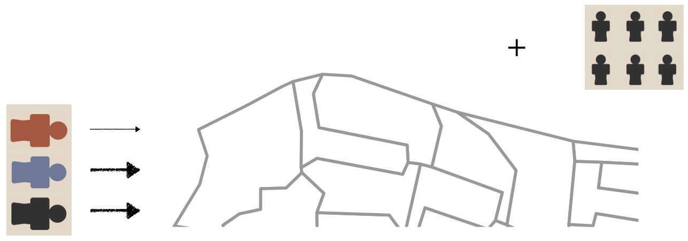</img>

---

## Spatial microsimulation

<br>
.pull-left[.right[
Microsimulation does not<br>
generate **new data** <br>
`-----`
]]

--

<br><br>
.pull-right[.left[
`-----` <br>
But **copies of existing data**
]]
---


## Spatial microsimulation: Assumptions

 .pull-left[
.small-font[
1. Individual-level microdata are representative of the study area <br>

2. Target variable is dependent on the constraint variables in a way that is relatively constant over space and time <br>

3. Input microdataset and constraints are sufficiently rich and detailed to reproduce the full diversity of individuals and areas in the study region
]]

---


## Simulating behaviour practical

 .pull-left[
 <br>
</img>
]

 .pull-right[
 <br>
 .small-font[
`individuals.csv : 15,189 records`
  <br>
  `-------` <br>
  spatial microsimulation <br>
  `-------` <br>
  `simulated_oac_age_sex.csv : 320,596 records`
]]
---


## Set-up

#### Task 1.2: Configure your R session

.xtiny-font[
```{r dependencies, echo=TRUE, eval=FALSE, out.width="60%"}
# Bundle of packages for data manipulation.
# install.packages("tidyverse")
library(tidyverse)

# For working with geospatial data.
# install.packages("sf")
library(sf)

# For performing microsimulation. If working from your own machine uncomment to download.
# install.packages("rakeR")

```
]

* [`rakeR`](https://philmikejones.me/rakeR/) <br>
.small-font[
 + *Create a spatial microsimulated data set in R using iterative proportional fitting (‘raking’).*
]
---


## Set-up

#### Task 1.3: Download and read in data

.small-font[
 * Download to your project's `data` folder.
]

.xtiny-font[
```{r download, eval=FALSE, echo=TRUE}
# Path to data download.
url_data <- "https://www.roger-beecham.com/datasets/"
download.file(paste0(url_data,"microsim_5927.zip"), "./data.zip")
unzip("./data.zip")
```
]


.small-font[
 * `read_csv()` for Census and Survey data | `st_read()` for boundary data.
]

.xtiny-font[
```{r read, eval=FALSE, echo=TRUE}
# Read in Census data (constraints)
age_cons <- read_csv("./data/age_cons.csv")
...
...

# Read in individual-level survey data
individuals <- read_csv("./data/individuals.csv")

# Read in geojson files defining OAs and wards in Leeds
oa_boundaries <- st_read("./data/oa_boundaries.geojson", crs=27700)
...
```
]
---

## Generate synthetic data

#### Task 2.1: Refactor variables and check for matches

.small-font[
 `individuals` and `*_cons` (Census) data need to be related
 ]

.xtiny-font[
 ```{r refactor-tibbles, eval=FALSE, echo=TRUE}
 # Recast as factor
 individuals <- individuals %>%
   mutate_at(
     vars(oac_grp, sex,age_band, age_sex),
     ~factor(.)
     )

 # Reorder according to order vars appear in constraints table : required by rakeR.
 individuals <- individuals %>%
   mutate(
     oac_grp=fct_relevel(oac_grp, colnames(oac_cons %>% select(-oa_code))),
     sex=fct_relevel(sex, colnames(sex_cons %>% select(-oa_code))),
     age_band=fct_relevel(age_band, colnames(age_cons %>% select(-oa_code))),
     age_sex=fct_relevel(age_sex, colnames(age_sex_cons %>% select(-oa_code)))
 )
 ```
 ]

---

## Generate synthetic data

#### Task 2.1: Refactor variables and check for matches

.small-font[
 `individuals` and `*_cons` (Census) data need to be related
 ]

.tiny-font[
1. **Convert** the `individuals` variables to be matched with the constraints tibbles as **factors**
]

.xtiny-font[
 ```{r convert, eval=FALSE, echo=TRUE}
 > class(individuals %>% pull(oac_grp))
[1] "numeric"

 # Recast as factor
 individuals <- individuals %>%
   mutate_at(
     vars(oac_grp, sex,age_band, age_sex),
     ~factor(.)
     )

> class(individuals %>% pull(oac_grp))
[1] "factor"
 ```
 ]


---

## Generate synthetic data

#### Task 2.1: Refactor variables and check for matches

.small-font[
 `individuals` and `*_cons` (Census) data need to be related
 ]

.tiny-font[
1. **Convert** the `individuals` variables to be matched with the constraints tibbles as **factors**
2. **Reorder** according to the variable order in the constraints tibbles
]

.xtiny-font[
 ```{r reorder, eval=FALSE, echo=TRUE}
# Reorder according to order vars appear in constraints table : required by rakeR.
individuals <- individuals %>%
  mutate(
    oac_grp=fct_relevel(oac_grp, colnames(oac_cons %>% select(-oa_code))),
    sex=fct_relevel(sex, colnames(sex_cons %>% select(-oa_code))),
    age_band=fct_relevel(age_band, colnames(age_cons %>% select(-oa_code))),
    age_sex=fct_relevel(age_sex, colnames(age_sex_cons %>% select(-oa_code)))
)

# Notice that the orders now match...
> colnames(age_cons)
[1] "oa_code"  "a24under" "a25to34"  "a35to49"  "a50to64"  "a65over"

> individuals %>% pull(age_band) %>% levels()
[1] "a24under" "a25to34"  "a35to49"  "a50to64"  "a65over"

```
]
---

## Generate synthetic data

#### Task 2.1: Refactor variables and check for matches

.small-font[
 `individuals` and `*_cons` (Census) data need to be related
 ]

.tiny-font[
1. **Convert** the `individuals` variables to be matched with the constraints tibbles as **factors**
2. **Reorder** according to the variable order in the constraints tibbles
]

.xtiny-font[
```{r check-match, eval=FALSE}
# Check levels and variable names exactly match.
> all.equal(
    levels(individuals$age_sex),
     colnames(age_sex_cons %>% select(-oa_code))
 )
[1] TRUE
```
]


.small-font[
 Note that both **values** and **orders** match:
 ]

.xtiny-font[
```{r check-match-example-fct, eval=FALSE}
> levels(individuals %>% pull(age_sex))
[1] "m24under" "m25to34"  "m35to49"  "m50to64"  "m65over"  "f24under" "f25to34"  "f35to49"  "f50to64"  "f65over"
```
]

.xtiny-font[
```{r check-match-example, eval=FALSE}
> colnames(age_sex_cons %>% select(-oa_code))
 [1] "m24under" "m25to34"  "m35to49"  "m50to64"  "m65over"  "f24under" "f25to34"  "f35to49"  "f50to64"  "f65over"
```
]


---

## Generate synthetic data

#### Task 2.2: Generate the miscrosimulated data

.tiny-font[
1. **Specify** the constraints data and store in `temp_cons` object
]

.xtiny-font[
```{r constraints, eval=FALSE}
# Identify the variables to use as constraints.
cons_vars <- c("oac_grp", "age_sex")

# Join to generate a single constraint table.
temp_cons <- oac_cons %>% inner_join(age_sex_cons)
# Joining, by = "oa_code"
```
]

<br>
.xtiny-font[
```{r temp-cons, eval=FALSE}
> temp_cons
# A tibble: 2,543 x 19
   oa_code     `1`   `2`   `3`   `4`   `5`   `6`   `7`   `8` m24under m25to34 m35to49 m50to64 m65over f24under f25to34
   <chr>     <dbl> <dbl> <dbl> <dbl> <dbl> <dbl> <dbl> <dbl>    <dbl>   <dbl>   <dbl>   <dbl>   <dbl>    <dbl>   <dbl>
 1 E00056750     0     0     0     0     0     0     0   141        1      14      23      22      22        5       9
 2 E00056751     0     0     0     0     0   110     0     0        0       7      30      23      12        0       7
 3 E00056752     0     0     0     0   200     0     0     0        1      19      31      33      18        5      19
 4 E00056753     0     0     0     0     0     0   141     0        5       8      15      13      27        2       4
 5 E00056754     0     0     0     0   131     0     0     0        5      11      33      20       8        3       9
 ```
 ]

---

## Generate synthetic data

#### Task 2.2: Generate the miscrosimulated data

.tiny-font[
1. **Specify** the constraints data and store in `temp_cons` object
2. **Generate** weights for pushing **individuals** to **output areas**
]

.xtiny-font[
```{r weights, eval=FALSE}
# Calculate weights. May take several seconds to execute.
weights_oac_age_sex <-
  rakeR::weight(
    cons=temp_cons,
    inds=individuals %>% select(person_id, oac_grp, age_sex),
    vars=cons_vars
    )
```
]

.xtiny-font[
```{r weight-doc, eval=FALSE}
?rakeR::weight
```
* **Description** :
Produces fractional weights using the iterative proportional fitting algorithm
* **Usage** :
`weight(cons, inds, vars = NULL, iterations = 10)` <br>
* **Argument**
  + `cons` : A data frame containing all the constraints
  + `inds` : A data frame containing individual–level (survey) data
  + `vars` : A character vector of variables that constrain the simulation (i.e. independent variables)
]

---

## Generate synthetic data

#### Task 2.2: Generate the miscrosimulated data

.tiny-font[
1. **Specify** the constraints data and store in `temp_cons` object
2. **Generate** weights for pushing individuals to output areas
3. **Clone** individuals and **assign** them to output areas
]

.xtiny-font[
```{r rake, eval=FALSE}
# Run rakeR::rake to generate simulated dataset. May take several seconds to execute.
simulated_oac_age_sex <- rakeR::rake(
  cons=temp_cons,
  inds=individuals %>% select(person_id, oac_grp, age_sex),
  vars=cons_vars, output = "integer",
  method = "trs"
  )
```
]

.xtiny-font[
```{r rake-doc, eval=FALSE}
?rakeR::rake
```
* **Usage** :
rake(cons, inds, vars)
 <br>
* **Argument**
  + `cons` : A data frame of constraint variables
  + `inds` : A data frame of individual–level (survey) data
  + `vars` : A character string of variables to iterate over
]

---


## Simulating behaviour practical

 .pull-left[
 <br>
</img>
]

 .pull-right[
 <br>
 .tiny-font[
`individuals.csv : 15,189 records`
  <br>
  `-------` <br>
  spatial microsimulation <br>
  `-------` <br>
  `simulated_oac_age_sex.csv : 320,596 records`
]
]

.tiny-font[
In case of problems and many `ERROR` messages:
]

 .xtiny-font[
```{r download-microsim-data, eval=FALSE, cache=TRUE}
#  Pre-prepared microsimulation dataset
simulated_oac_age_sex <-read_csv("https://www.roger-beecham.com/datasets/microsim.csv")
```
]
---

## Explore uncertainty

#### Task 3.1: Generate oa-level summary statistics

.tiny-font[
Some [`dplyr`](https://github.com/tidyverse/dplyr) operations with which you may be familiar:
]

 .pull-left[
.xtiny-font[
```{r oa-stats, eval=FALSE, cache=TRUE}
# Generate OA-level summary statistics on weights.
temp_weights_summary <- weights_oac_age_sex %>%
  gather(...) %>%
  group_by(...) %>%
  filter(...) %>%
  summarise(...)

# Generate OA-level summary statistics on simulated data.
temp_simulated_summary <- simulated_oac_age_sex %>%
  group_by(...) %>%
  summarise(...) %>%
  select(...)

# Merge and gather for charting.
oa_level_summary <- temp_weights_summary %>%
  inner_join(...) %>%
  gather(...)
```
]
]

 .pull-right[
 .xtiny-font[
```{r oa-stats-example, eval=FALSE, cache=TRUE}
> oa_level_summary
# A tibble: 10,172 x 3
   oa_code   statistic_type statistic_value
   <chr>     <chr>                    <dbl>
 1 E00056750 weight_mean             0.0528
 2 E00056751 weight_mean             0.0257
 3 E00056752 weight_mean             0.0492
 4 E00056753 weight_mean             0.124
 5 E00056754 weight_mean             0.0322
 6 E00056755 weight_mean             0.0369
 7 E00056756 weight_mean             0.0472
 8 E00056757 weight_mean             0.0254
 9 E00056758 weight_mean             0.0306
10 E00056759 weight_mean             0.0220
# … with 10,162 more rows
```
]]
--
.tiny-font[
But a very large dataset, so in case of problems:
]

.xtiny-font[
```{r oa-stats-import, eval=FALSE, cache=TRUE}
# Download pre-prepared microsimulation dataset.
oa_level_summary <- read_csv("https://www.roger-beecham.com/datasets/microsim_summary.csv")
```
]


---

## Explore uncertainty

#### Task 3.2: Plot oa-level summary statistics

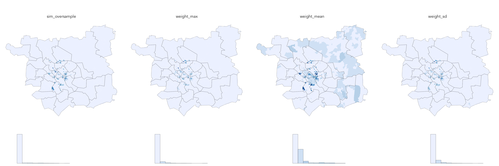</img>


---


## Explore uncertainty

#### Task 3.2: Plot oa-level summary statistics


.pull-left[
.xtiny-font[
Plot histogram:
```{r plot-oa-stats-hist, eval=FALSE, cache=TRUE}

oa_level_summary %>%
  ggplot(aes(x=statistic_value))+
  geom_histogram() +
  facet_wrap(~statistic_type)
```
]
]

.pull-right[
.xtiny-font[
Plot spec:
* **data** : `oa_level_summary`
* **encoding** : hist mapped to `statistic_value`
* **marks** : `geom_histogram()` chart type
* **facets** : charts split on `statistic_type`
]]

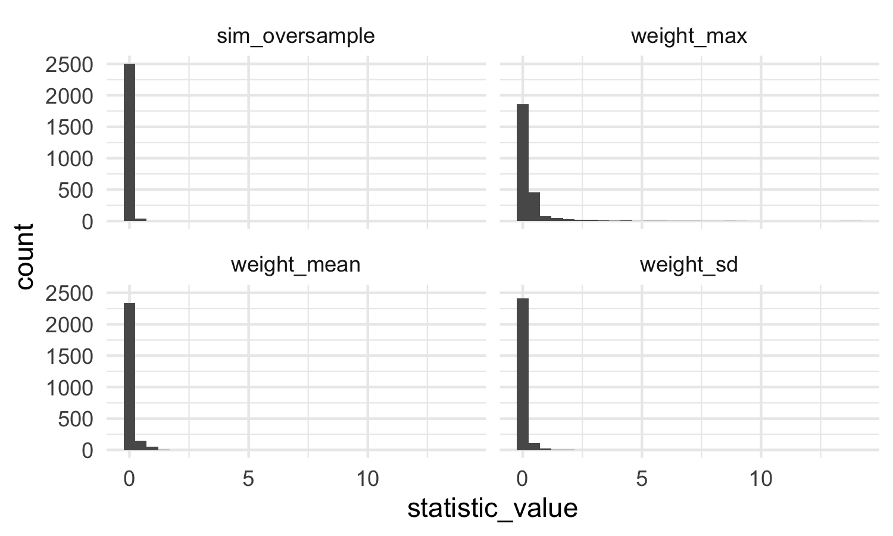</img>


---

## Explore uncertainty

#### Task 3.2: Plot oa-level summary statistics


.pull-left[
.xtiny-font[
Plot histogram:
```{r plot-oa-stats-hist-bin, eval=FALSE, cache=TRUE}
oa_level_summary %>%
  ggplot(aes(x=statistic_value))+
  geom_histogram(bins=10) +
  facet_wrap(~statistic_type)
```
]
]

.pull-right[
.xtiny-font[
Plot spec:
* **data** : `oa_level_summary`
* **encoding** : hist mapped to `statistic_value`
* **marks** : `geom_histogram()` chart type
* **facets** : charts split on `statistic_type`
* **setting** : `bins=` argument to 10
]]

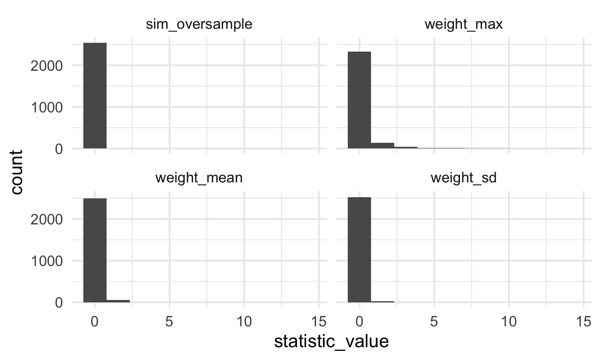</img>


---


## Explore uncertainty

#### Task 3.2: Plot oa-level summary statistics


.pull-left[
.xtiny-font[
Plot histogram:
```{r plot-oa-stats-hist-bin-colour, eval=FALSE, cache=TRUE}
oa_level_summary %>%
  ggplot(aes(x=statistic_value, fill=..x..)) +
  geom_histogram(colour="#636363", size=0.1, bins=10) +
  facet_wrap(~statistic_type) +
  scale_fill_distiller(palette="Blues", direction=1, guide=FALSE)
```
]
]

.pull-right[
.xtiny-font[
Plot spec:
* **data** : `oa_level_summary`
* **encoding** : `fill` on binned values (`..x..`)
* **marks** : `geom_histogram()` chart type
* **facets** : charts split on `statistic_type`
* **setting** : `colour` grey outlines
* **scales** : `scale_fill_distiller()` for [brewer](https://colorbrewer2.org/#type=sequential&scheme=BuGn&n=3) palette.
]]

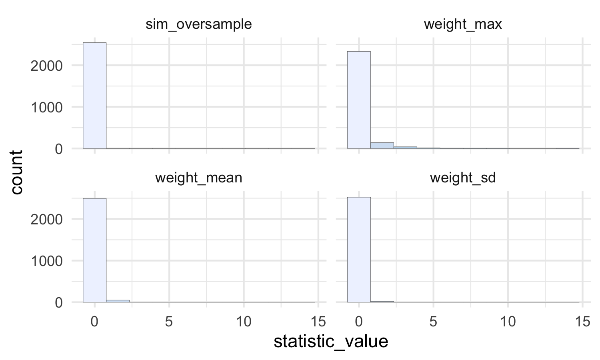</img>


---

## Explore uncertainty

#### Task 3.2: Plot oa-level summary statistics


.pull-left[
.xtiny-font[
Plot histogram:
```{r plot-oa-stats-hist-bin-colour-rescale, eval=FALSE, cache=TRUE}
oa_level_summary %>%
  group_by(statistic_type) %>%
  mutate(
    statistic_value_rescale=
      scales::rescale(statistic_value, to=c(0,1), from=c(min(statistic_value), max(statistic_value)))
    ) %>%
  ungroup() %>%
  ggplot(aes(x=statistic_value_rescale, fill=..x..))+
  geom_histogram(colour="#636363", size=0.1, bins=10) +
  facet_wrap(~statistic_type, nrow=1) +
  scale_fill_distiller(palette="Blues", direction=1, guide=FALSE)
```
]
]

.pull-right[
.xtiny-font[
Plot spec:
* **data** : `oa_level_summary` with `statistic_value` rescaled to 0--1
* **encoding** : `fill` on binned values (`..x..`)
* **marks** : `geom_histogram()` chart type
* **facets** : charts split on `statistic_type`
* **setting** : `colour` grey outlines
* **scales** : `scale_fill_distiller()` using [brewer](https://colorbrewer2.org/#type=sequential&scheme=BuGn&n=3) palette.
]]

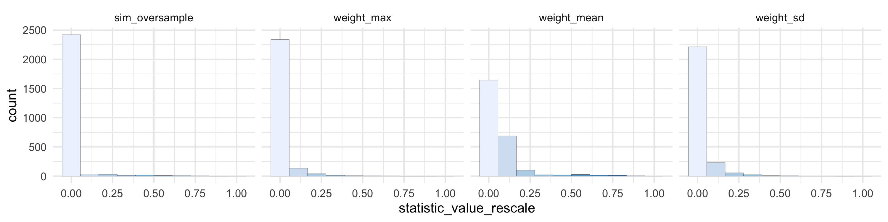</img>


---

## Explore uncertainty

#### Task 3.2: Plot oa-level summary statistics

.xtiny-font[
Stage data for choropleth:
```{r stage-data, eval=FALSE, cache=TRUE}
plot_data <- oa_level_summary %>%
  group_by(statistic_type) %>%
  mutate(
    # Rescale summary stats between 0 and 1 for local scale on facet.
    statistic_value_rescale=scales::rescale(
      statistic_value, to=c(0,1), from=c(min(statistic_value), max(statistic_value)))
      )
    # Cut into equal-range bins as per histogram.
    statistic_value_bin=cut_interval(statistic_value_rescale, 10, labels=FALSE)
  ) %>%
  ungroup()
```
]

---

## Explore uncertainty

#### Task 3.2: Plot oa-level summary statistics

.pull-left[
.xtiny-font[
Plot choropleth:
```{r plot-choropleth, eval=FALSE, cache=TRUE}
oa_boundaries %>%
  left_join(plot_data) %>%
  ggplot()+
    geom_sf(aes(fill=statistic_value_bin), colour=NA)+
    geom_sf(data=ward_boundaries, fill="transparent", colour="#636363", size=0.1)+
    coord_sf(crs=st_crs(oa_boundaries), datum=NA)+
    scale_fill_distiller(palette="Blues", direction=1, guide=FALSE)+
    facet_wrap(~statistic_type, nrow=1)
```
]]

.pull-right[
.xtiny-font[
Plot spec:
* **data** : `plot_data` joined with boundary data `oa_boundaries`
* **encoding** : `fill` on binned values (`statistic_value_bin`)
* **marks** : `geom_sf()` for output area polygons
* **facets** : maps split on `statistic_type`
* **setting** : `colour` grey outlines for `ward_boundaries`
* **scales** : `scale_fill_distiller()` using [brewer](https://colorbrewer2.org/#type=sequential&scheme=BuGn&n=3) palette
* **coord** : `coord_sf` as `geometry` is drawn
]]

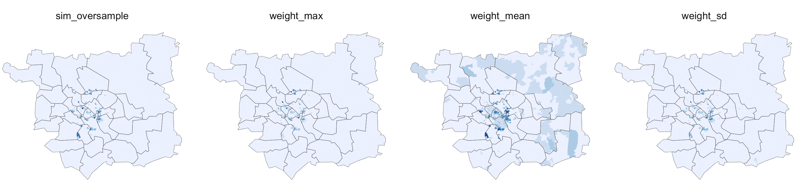</img>

---
## Module Schedule

```{r schedule-again, echo=FALSE, out.width="100%"}
schedule <- tibble::tibble(
  session = c("1", "2", "3", "4", "5"),
  wc =c("28 Feb", "7 Mar", "14 Mar", "21 Mar", "25 Apr"),
  lecture = c("mon 1500-1600", "mon 1500-1600", "mon 1500-1600", "mon 1500-1600", "mon 1500-1600"),
  lab = c("wed 1100-1800", "wed 1100-1800", "wed 1100-1800", "wed 1100-1800", "NA - pres"),
  recap = c("fri 1700-1800", "fri 1700-1800", "fri 1700-1800", "fri 1700-1800", "NA")
)

kbl(schedule) %>%
  row_spec(0, background = "#ffffff", font_size = 18 ) %>%
  row_spec(1:5, background = "#ffffff", font_size = 20)
```
