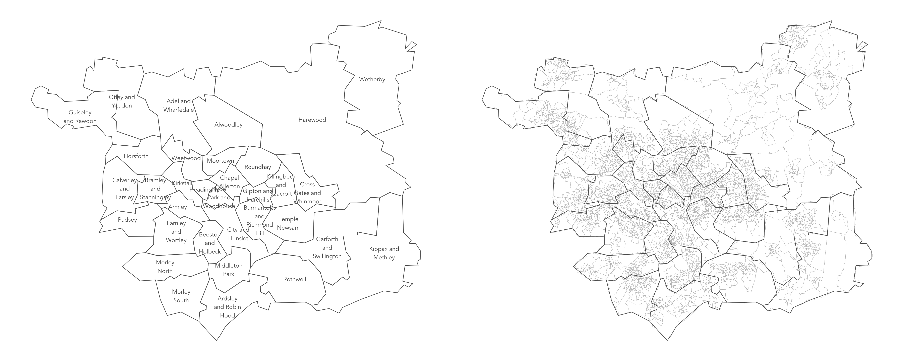

```{r setup, include=FALSE, echo=FALSE}
options(htmltools.dir.version = FALSE)
knitr::opts_chunk$set(comment = "")
library(tidyverse)
library(here)
library(knitr)
library(kableExtra)
```


## Module Schedule

```{r outline, echo=FALSE, out.width="100%"}
outline <- tibble::tibble(
  session = c("1", "2", "3", "4", "5"),
  wc =c("21 Jun", "28 Jun", "5 Jul", "12 Jul", "19 Jul"),
  academic=c("RB","RB", "JG/NM", "RO/RB", "RB/JG/NM/RO"),
  lecture = c("Predictive analytics & microsimulation", "Response modelling and targeted marketing", "Behavioural and agent-based models",
  "Coursework surgery", "Guest lecture and wrap-up"),
  progress=c("#1 data","#1 analysis","#2 material","#1 surgery","#2 surgery")
)
kbl(outline) %>%
  row_spec(0, background = "#ffffff", font_size = 18 ) %>%
  row_spec(1:5, background = "#ffffff", font_size=20) %>%
  row_spec(c(1:3,5), color="#616161")
```

---


## Assigment #1

</img>
.tiny-font[
[`Assignment #1 url`](https://minerva.leeds.ac.uk/webapps/blackboard/content/listContentEditable.jsp?content_id=_7983616_1&course_id=_521220_1&mode=reset)]

???

What I’m looking for :
	General 1 : A well-scoped data analysis. Data you select, techniques use to analyse it and presentation makes sense given your focus.
	General 2 : That  all analysis and recommendations are evidence-based – that is they are clearly informed by your data analysis.

---


## Assigment #1

</img>
.tiny-font[
[`Assignment #1 url`](https://minerva.leeds.ac.uk/webapps/blackboard/content/listContentEditable.jsp?content_id=_7983616_1&course_id=_521220_1&mode=reset)]

???

What I’m looking for :
	General 1 : A well-scoped data analysis. Data you select, techniques use to analyse it and presentation makes sense given your focus.
	General 2 : That  all analysis and recommendations are evidence-based – that is they are clearly informed by your data analysis.

---

## Assigment #1

.small-font[
`individuals.csv`
  `15,189 records`
  <br>
  `--------`
  <br>
  `simulated_oac_age_sex.csv`
    `320,596 records`
]
</img>

???

Remember : we’ve got this simulated population-level dataset.
Each row is a household in Leeds that have recently returned from holiday — thought where certain areas in Leeds are better characterised than others

---


## Assigment #1

.small-font[Identify and profile a target market using:]

 .tiny-font[
* **Demographics**
   + income, age, household structure

* **Geography**
   + where and what types of areas they tend to live in

* **Psychographics**
    +  their motivations and preferences
]

???

1. Define group of interest -- destination type / customer type
2. Identify what makes those holidaying there distinctive
3. So that can target in particular ways

Of interest:

* demographics : what types of people in terms of income, age profile?
* geography : where those individuals live (heavily related to demogs)?
* psychographics : their preferences, motivations and more subjective tastes

---

## Assigment #1

`simulated_oac_age_sex.csv`
  `320,596 records`

  ```{r survey-data, echo=FALSE, out.width="100%"}
  team <- tibble::tibble(
    var_name = c("age_band", "income_band", "oac_grp", "uk_airport", "overseas_airport", "satisfaction_overall"),
    var_values = c("a24under, ...", "11-15k, ...", "1,2,3,...", "MAN, DSA, ...","TFS, EFL, ...", "1_poor, ..."),
    var_type = c("demographic", "demographic", "geodemographic", "preference", "preference", "preference/attitude")
  )
  kbl(team) %>%
    row_spec(0, background = "#ffffff", font_size = 18) %>%
    row_spec(1:6, background = "#ffffff", font_size = 16)
  ```


---

## Assigment #1


</img>

</img>

???

In the guided data analysis in the practical, you’re asked to profile those holidaying to IBIZA.

* This population has two age peaks
* Comparatively few higher incomes
* Mix of more affluent and deprived neighbourhood types

But is this particularly distinctive? How does this relate to all of Leeds (all households in our simulated dataset)?

---

## Assigment #1


</img>
</img>
</img>

---

## Assigment #1


</img>
</img>
</img>
</img>

---

## Assigment #1

<br>
.small-font[**Deviation** from **Expectation**]

</img>

<br><br><br><br><br><br><br>
.xtiny-font[Correll & Heer (2017) Surprise! Bayesian Weighting for De-Biasing Thematic Maps, IEEE TVCG]


---

## Assigment #2

### Guidelies for effective presentations


---

## Assigment #2

### Guideline 1: Avoid noise

.small-font[
* Background colours

* Logos

* Overly small font

* Too much text

* Unnecessary transitions
]

---


## Assigment #2

### Guideline 1: Avoid noise

--

</img>

--

</img>

--

</img>

--

</img>

--

</img>


---

## Assigment #2

### Guideline 1: Avoid noise

</img>
</img>


---

## Assigment #2

### Guideline 2: Refine
<br>
> .small-font[
*With each slide,* <br>
*convey one message (only)*]

???

Very easy to load slides with content.
Try to be judicious with the message.

---

## Assigment #2

### Guideline 3: Reduce
<br>
> .small-font[
*Be concise,* <br>
*both verbally and visually*]

???

Say what you want to say with the least number of words.

---

## Assigment #2

### Guideline 4: Compliment
<br>
> .small-font[
*Slides should display things that* <br>
*can’t be easily spoken*]

???

Say what you want to say with the least number of words.

---

## Assigment #2

### Guideline 5: Layout

--
</img>
--
</img>

???

Do think about ordering your slides meaningfully : layout is powerful.

---

## Assigment #2

### Guideline 5: Layout

--
</img>


---
## Assigment #2

### Guideline 5: Layout

</img>

---
## Assigment #2

### Guideline 5: Layout - order

.small-font[
<br>

> *We expect things to be displayed
    in sequence.*
<br><br>
> *If we wish to imply a sequence,
     arrange things in that sequence.*
<br><br>
> *This  can be particularly useful when ‘telling a story’ in a presentation.*
]

???

We expect a story, a sequence

We can imply that sequence in our presentations by ordering slides and charts

Doing so allows us to tell data stories.


---

## Assigment #2

### Jean-Luc Doumont

<div class="embed-responsive embed-responsive-16by9">
<iframe width="500" height="350" class="embed-responsive-item" src="https://www.youtube.com/embed/meBXuTIPJQk" frameborder="0" allow="accelerometer; autoplay; encrypted-media; gyroscope; picture-in-picture" allowfullscreen></iframe>
</div>

<!-- </img> -->
